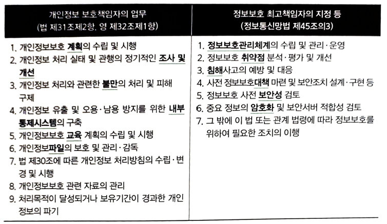
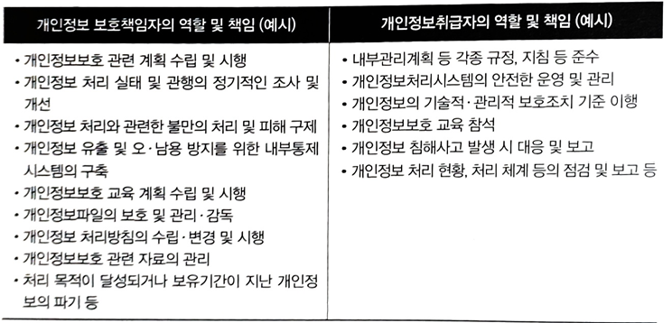
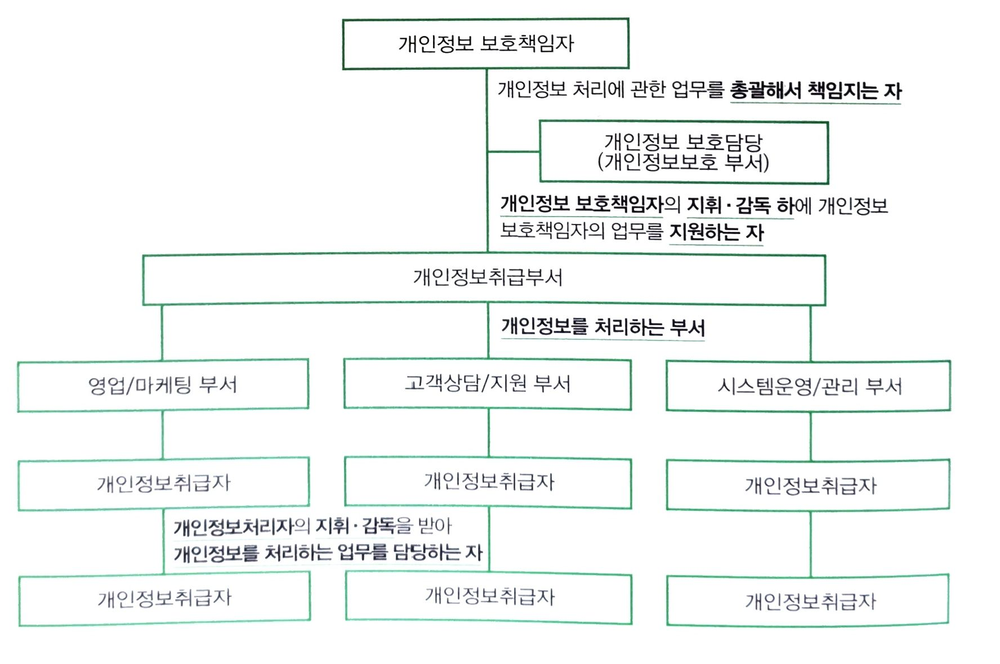
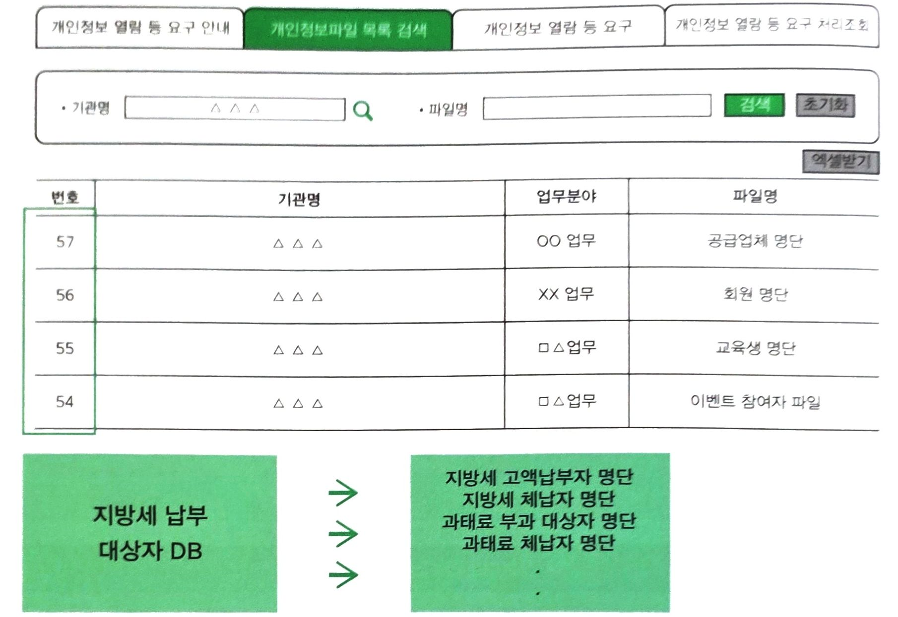

### 11 개인정보 처리방침

(1) 관련법령
``` 
개인정보보호법(2024.3.15)제30조
 제30조(개인정보의 안전성 확보 조치) ① 개인정보처리자는 법 제29조에 따라 다음 각 호의 안전성 확보 조치를 해야 한다. <개정 2023. 9. 12.>
1. 개인정보의 안전한 처리를 위한 다음 각 목의 내용을 포함하는 내부 관리계획의 수립ㆍ시행 및 점검
가. 법 제28조제1항에 따른 개인정보취급자(이하 “개인정보취급자”라 한다)에 대한 관리ㆍ감독 및 교육에 관한 사항
나. 법 제31조에 따른 개인정보 보호책임자의 지정 등 개인정보 보호 조직의 구성ㆍ운영에 관한 사항
다. 제2호부터 제8호까지의 규정에 따른 조치를 이행하기 위하여 필요한 세부 사항
2. 개인정보에 대한 접근 권한을 제한하기 위한 다음 각 목의 조치
가. 데이터베이스시스템 등 개인정보를 처리할 수 있도록 체계적으로 구성한 시스템(이하 “개인정보처리시스템”이라 한다)에 대한 접근 권한의 부여ㆍ변경ㆍ말소 등에 관한 기준의 수립ㆍ시행
나. 정당한 권한을 가진 자에 의한 접근인지를 확인하기 위해 필요한 인증수단 적용 기준의 설정 및 운영
다. 그 밖에 개인정보에 대한 접근 권한을 제한하기 위하여 필요한 조치
3. 개인정보에 대한 접근을 통제하기 위한 다음 각 목의 조치
가. 개인정보처리시스템에 대한 침입을 탐지하고 차단하기 위하여 필요한 조치
나. 개인정보처리시스템에 접속하는 개인정보취급자의 컴퓨터 등으로서 보호위원회가 정하여 고시하는 기준에 해당하는 컴퓨터 등에 대한 인터넷망의 차단. 다만, 전년도 말 기준 직전 3개월 간 그 개인정보가 저장ㆍ관리되고 있는 「정보통신망 이용촉진 및 정보보호 등에 관한 법률」 제2조제1항제4호에 따른 이용자 수가 일일평균 100만명 이상인 개인정보처리자만 해당한다.
다. 그 밖에 개인정보에 대한 접근을 통제하기 위하여 필요한 조치
4. 개인정보를 안전하게 저장ㆍ전송하는데 필요한 다음 각 목의 조치
가. 비밀번호의 일방향 암호화 저장 등 인증정보의 암호화 저장 또는 이에 상응하는 조치
나. 주민등록번호 등 보호위원회가 정하여 고시하는 정보의 암호화 저장 또는 이에 상응하는 조치
다. 「정보통신망 이용촉진 및 정보보호 등에 관한 법률」 제2조제1항제1호에 따른 정보통신망을 통하여 정보주체의 개인정보 또는 인증정보를 송신ㆍ수신하는 경우 해당 정보의 암호화 또는 이에 상응하는 조치
라. 그 밖에 암호화 또는 이에 상응하는 기술을 이용한 보안조치
5. 개인정보 침해사고 발생에 대응하기 위한 접속기록의 보관 및 위조ㆍ변조 방지를 위한 다음 각 목의 조치
가. 개인정보처리시스템에 접속한 자의 접속일시, 처리내역 등 접속기록의 저장ㆍ점검 및 이의 확인ㆍ감독
나. 개인정보처리시스템에 대한 접속기록의 안전한 보관
다. 그 밖에 접속기록 보관 및 위조ㆍ변조 방지를 위하여 필요한 조치
6. 개인정보처리시스템 및 개인정보취급자가 개인정보 처리에 이용하는 정보기기에 대해 컴퓨터바이러스, 스파이웨어, 랜섬웨어 등 악성프로그램의 침투 여부를 항시 점검ㆍ치료할 수 있도록 하는 등의 기능이 포함된 프로그램의 설치ㆍ운영과 주기적 갱신ㆍ점검 조치
7. 개인정보의 안전한 보관을 위한 보관시설의 마련 또는 잠금장치의 설치 등 물리적 조치
8. 그 밖에 개인정보의 안전성 확보를 위하여 필요한 조치
② 보호위원회는 개인정보처리자가 제1항에 따른 안전성 확보 조치를 하도록 시스템을 구축하는 등 필요한 지원을 할 수 있다. <개정 2013. 3. 23., 2014. 11. 19., 2017. 7. 26., 2020. 8. 4.>
③ 제1항에 따른 안전성 확보 조치에 관한 세부 기준은 보호위원회가 정하여 고시한다. <개정 2013. 3. 23., 2014. 11. 19., 2017. 7. 26., 2020. 8. 4.>

개인정보보호법(2024.3.15)제30조의2
제30조의2(개인정보 처리방침의 평가 및 개선권고) ① 보호위원회는 개인정보 처리방침에 관하여 다음 각 호의 사항을 평가하고, 평가 결과 개선이 필요하다고 인정하는 경우에는 개인정보처리자에게 제61조제2항에 따라 개선을 권고할 수 있다.
1. 이 법에 따라 개인정보 처리방침에 포함하여야 할 사항을 적정하게 정하고 있는지 여부
2. 개인정보 처리방침을 알기 쉽게 작성하였는지 여부
3. 개인정보 처리방침을 정보주체가 쉽게 확인할 수 있는 방법으로 공개하고 있는지 여부
   ② 개인정보 처리방침의 평가 대상, 기준 및 절차 등에 필요한 사항은 대통령령으로 정한다.
```

(2)관련지식

1 ) 개인정보 처리방침 포함 사항(시행령 31조)

1. 처리하는 개인정보의 항목
2. 제 30조 또는 제 48조의2에 따른 개인정보의 안전성 확보 조치에 관한 사항

2 ) 개인정보 처리방침 임의기재사항(개인정보 처리방침 작성 예시•보호위원회)

1. 정보주체의 권익침해에 대한 구제방법
2. 개인정보의 열람청구를 접수•처리하는 부서
3. 영상정보처리기기 운영•관리에 관한 사항

3 ) 개인정보 처리방침 공개 방법

```
개인정보보호법 시행령(2024.9.15)제31조(개인정보 처리방침의 내용 및 공개방법 등)
제31조(개인정보 처리방침의 내용 및 공개방법 등) ① 법 제30조제1항제8호에서 “대통령령으로 정한 사항”이란 다음 각 호의 사항을 말한다. <개정 2016. 9. 29., 2020. 8. 4., 2023. 9. 12., 2024. 3. 12.>
1. 처리하는 개인정보의 항목
2. 법 제28조의8제1항 각 호에 따라 개인정보를 국외로 이전하는 경우 국외 이전의 근거와 같은 조 제2항 각 호의 사항
3. 제30조에 따른 개인정보의 안전성 확보 조치에 관한 사항
4. 국외에서 국내 정보주체의 개인정보를 직접 수집하여 처리하는 경우 개인정보를 처리하는 국가명
② 개인정보처리자는 법 제30조제2항에 따라 수립하거나 변경한 개인정보 처리방침을 개인정보처리자의 인터넷 홈페이지에 지속적으로 게재하여야 한다.
③ 제2항에 따라 인터넷 홈페이지에 게재할 수 없는 경우에는 다음 각 호의 어느 하나 이상의 방법으로 수립하거나 변경한 개인정보 처리방침을 공개하여야 한다. <개정 2023. 9. 12.>
1. 개인정보처리자의 사업장등의 보기 쉬운 장소에 게시하는 방법
2. 관보(개인정보처리자가 공공기관인 경우만 해당한다)나 개인정보처리자의 사업장등이 있는 시ㆍ도 이상의 지역을 주된 보급지역으로 하는 「신문 등의 진흥에 관한 법률」 제2조제1호가목ㆍ다목 및 같은 조 제2호에 따른 일반일간신문, 일반주간신문 또는 인터넷신문에 싣는 방법
3. 같은 제목으로 연 2회 이상 발행하여 정보주체에게 배포하는 간행물ㆍ소식지ㆍ홍보지 또는 청구서 등에 지속적으로 싣는 방법
4. 재화나 서비스를 제공하기 위하여 개인정보처리자와 정보주체가 작성한 계약서 등에 실어 정보주체에게 발급하는 방법

->인터넷 홈페이지, 사업장, 간행물, 신문, 관보, 계약서
```
4 ) 공공기관 개인정보 처리방침 등록 면제가 가능한 경우

```
개인정보 보호법(2024.3.15)제33조(개인정보파일의 등록 및 공개)
제33조(개인정보 영향평가) ① 공공기관의 장은 대통령령으로 정하는 기준에 해당하는 개인정보파일의 운용으로 인하여 정보주체의 개인정보 침해가 우려되는 경우에는 그 위험요인의 분석과 개선 사항 도출을 위한 평가(이하 “영향평가”라 한다)를 하고 그 결과를 보호위원회에 제출하여야 한다. <개정 2013. 3. 23., 2014. 11. 19., 2017. 7. 26., 2020. 2. 4., 2023. 3. 14.>
② 보호위원회는 대통령령으로 정하는 인력ㆍ설비 및 그 밖에 필요한 요건을 갖춘 자를 영향평가를 수행하는 기관(이하 “평가기관”이라 한다)으로 지정할 수 있으며, 공공기관의 장은 영향평가를 평가기관에 의뢰하여야 한다. <신설 2023. 3. 14.>
③ 영향평가를 하는 경우에는 다음 각 호의 사항을 고려하여야 한다. <개정 2023. 3. 14.>
1. 처리하는 개인정보의 수
2. 개인정보의 제3자 제공 여부
3. 정보주체의 권리를 해할 가능성 및 그 위험 정도
4. 그 밖에 대통령령으로 정한 사항
④ 보호위원회는 제1항에 따라 제출받은 영향평가 결과에 대하여 의견을 제시할 수 있다. <개정 2013. 3. 23., 2014. 11. 19., 2017. 7. 26., 2020. 2. 4., 2023. 3. 14.>
⑤ 공공기관의 장은 제1항에 따라 영향평가를 한 개인정보파일을 제32조제1항에 따라 등록할 때에는 영향평가 결과를 함께 첨부하여야 한다. <개정 2023. 3. 14.>
⑥ 보호위원회는 영향평가의 활성화를 위하여 관계 전문가의 육성, 영향평가 기준의 개발ㆍ보급 등 필요한 조치를 마련하여야 한다. <개정 2013. 3. 23., 2014. 11. 19., 2017. 7. 26., 2020. 2. 4., 2023. 3. 14.>
⑦ 보호위원회는 제2항에 따라 지정된 평가기관이 다음 각 호의 어느 하나에 해당하는 경우에는 평가기관의 지정을 취소할 수 있다. 다만, 제1호 또는 제2호에 해당하는 경우에는 평가기관의 지정을 취소하여야 한다. <신설 2023. 3. 14.>
1. 거짓이나 그 밖의 부정한 방법으로 지정을 받은 경우
2. 지정된 평가기관 스스로 지정취소를 원하거나 폐업한 경우
3. 제2항에 따른 지정요건을 충족하지 못하게 된 경우
4. 고의 또는 중대한 과실로 영향평가업무를 부실하게 수행하여 그 업무를 적정하게 수행할 수 없다고 인정되는 경우
5. 그 밖에 대통령령으로 정하는 사유에 해당하는 경우
⑧ 보호위원회는 제7항에 따라 지정을 취소하는 경우에는 「행정절차법」에 따른 청문을 실시하여야 한다. <신설 2023. 3. 14.>
⑨ 제1항에 따른 영향평가의 기준ㆍ방법ㆍ절차 등에 관하여 필요한 사항은 대통령령으로 정한다. <개정 2023. 3. 14.>
⑩ 국회, 법원, 헌법재판소, 중앙선거관리위원회(그 소속 기관을 포함한다)의 영향평가에 관한 사항은 국회규칙, 대법원규칙, 헌법재판소규칙 및 중앙선거관리위원회규칙으로 정하는 바에 따른다. <개정 2023. 3. 14.>
⑪ 공공기관 외의 개인정보처리자는 개인정보파일 운용으로 인하여 정보주체의 개인정보 침해가 우려되는 경우에는 영향평가를 하기 위하여 적극 노력하여야 한다. <개정 2023. 3. 14.>

->비밀, 범죄 수사, 형 집행, 안전, 내부적 업무, 조세, 출입국, 관세

개인정보 보호법(2024.3.15)제58조(적용의 일부 제외)
제58조(적용의 일부 제외) ① 다음 각 호의 어느 하나에 해당하는 개인정보에 관하여는 제3장부터 제8장까지를 적용하지 아니한다. <개정 2023. 3. 14.>
1. 삭제 <2023. 3. 14.>
2. 국가안전보장과 관련된 정보 분석을 목적으로 수집 또는 제공 요청되는 개인정보
3. 삭제 <2023. 3. 14.>
4. 언론, 종교단체, 정당이 각각 취재·보도, 선교, 선거 입후보자 추천 등 고유 목적을 달성하기 위하여 수집·이용하는 개인정보
② 제25조제1항 각 호에 따라 공개된 장소에 고정형 영상정보처리기기를 설치·운영하여 처리되는 개인정보에 대해서는 제15조, 제22조, 제22조의2, 제27조제1항·제2항, 제34조 및 제37조를 적용하지 아니한다. <개정 2023. 3. 14.>
③ 개인정보처리자가 동창회, 동호회 등 친목 도모를 위한 단체를 운영하기 위하여 개인정보를 처리하는 경우에는 제15조, 제30조 및 제31조를 적용하지 아니한다.
④ 개인정보처리자는 제1항 각 호에 따라 개인정보를 처리하는 경우에도 그 목적을 위하여 필요한 범위에서 최소한의 기간에 최소한의 개인정보만을 처리하여야 하며, 개인정보의 안전한 관리를 위하여 필요한 기술적·관리적 및 물리적 보호조치, 개인정보의 처리에 관한 고충처리, 그 밖에 개인정보의 적절한 처리를 위하여 필요한 조치를 마련하여야 한다.

표준 개인정보보호지침 제50조
제50조(적용제외) 이 장은 다음 각 호의 어느 하나에 해당하는 개인정보파일에 관하여는 적용하지 아니한다.  
1. 국회, 법원, 헌법재판소, 중앙선거관리위원회(그 소속기관을 포함한다)에서 관리하는 개인정보파일 
2. 법 제32조제2항에 따라 적용이 제외되는 다음 각목의 개인정보파일 
가. 국가안전, 외교상 비밀, 그 밖에 국가의 중대한 이익에 관한 사항을 기록한 개인정보파일 
나. 범죄의 수사, 공소의 제기 및 유지, 형 및 감호의 집행, 교정처분, 보호처분, 보안관찰처분과 출입국 관리에 관한 사항을 기록한 개인정보파일 
다. 「조세범처벌법」에 따른 범칙행위 조사 및 「관세법」에 따른 범칙행위 조사에 관한 사항을 기록한 개인정보파일 
라. 공공기관의 내부적 업무처리만을 위하여 사용되는 개인정보파일 
마. 다른 법령에 따라 비밀로 분류된 개인정보파일 
3. 법 제58조제1항에 따라 적용이 제외되는 다음 각목의 개인정보파일 
가. 공공기관이 처리하는 개인정보 중 「통계법」에 따라 수집되는 개인정보파일 
나. 국가안전보장과 관련된 정보 분석을 목적으로 수집 또는 제공 요청되는 개인정보파일 
다. 공중위생 등 공공의 안전과 안녕을 위하여 긴급히 필요한 경우로서 일시적으로 처리되는 개인정보파일 
4. 영상정보처리기기를 통하여 처리되는 개인영상정보파일 
5. 자료·물품 또는 금전의 송부, 1회성 행사 수행 등의 목적만을 위하여 운용하는 경우로서 저장하거나 기록하지 않고 폐기할 목적으로 수집된 개인정보파일 
6. 「금융실명거래 및 비밀보장에 관한 법률」에 따른 금융기관이 금융업무 취급을 위해 보유하는 개인정보파일 
```

### 12 개인정보보호책임자
(1) 관련법령
```
개인정보보호법(2024.3.15)제31조
제31조(개인정보 보호책임자의 지정 등) ① 개인정보처리자는 개인정보의 처리에 관한 업무를 총괄해서 책임질 개인정보 보호책임자를 지정하여야 한다. 다만, 종업원 수, 매출액 등이 대통령령으로 정하는 기준에 해당하는 개인정보처리자의 경우에는 지정하지 아니할 수 있다. <개정 2023. 3. 14.>
② 제1항 단서에 따라 개인정보 보호책임자를 지정하지 아니하는 경우에는 개인정보처리자의 사업주 또는 대표자가 개인정보 보호책임자가 된다. <신설 2023. 3. 14.>
③ 개인정보 보호책임자는 다음 각 호의 업무를 수행한다. <개정 2023. 3. 14.>
1. 개인정보 보호 계획의 수립 및 시행
2. 개인정보 처리 실태 및 관행의 정기적인 조사 및 개선
3. 개인정보 처리와 관련한 불만의 처리 및 피해 구제
4. 개인정보 유출 및 오용ㆍ남용 방지를 위한 내부통제시스템의 구축
5. 개인정보 보호 교육 계획의 수립 및 시행
6. 개인정보파일의 보호 및 관리ㆍ감독
7. 그 밖에 개인정보의 적절한 처리를 위하여 대통령령으로 정한 업무
④ 개인정보 보호책임자는 제3항 각 호의 업무를 수행함에 있어서 필요한 경우 개인정보의 처리 현황, 처리 체계 등에 대하여 수시로 조사하거나 관계 당사자로부터 보고를 받을 수 있다. <개정 2023. 3. 14.>
⑤ 개인정보 보호책임자는 개인정보 보호와 관련하여 이 법 및 다른 관계 법령의 위반 사실을 알게 된 경우에는 즉시 개선조치를 하여야 하며, 필요하면 소속 기관 또는 단체의 장에게 개선조치를 보고하여야 한다. <개정 2023. 3. 14.>
⑥ 개인정보처리자는 개인정보 보호책임자가 제3항 각 호의 업무를 수행함에 있어서 정당한 이유 없이 불이익을 주거나 받게 하여서는 아니 되며, 개인정보 보호책임자가 업무를 독립적으로 수행할 수 있도록 보장하여야 한다. <개정 2023. 3. 14.>
⑦ 개인정보처리자는 개인정보의 안전한 처리 및 보호, 정보의 교류, 그 밖에 대통령령으로 정하는 공동의 사업을 수행하기 위하여 제1항에 따른 개인정보 보호책임자를 구성원으로 하는 개인정보 보호책임자 협의회를 구성ㆍ운영할 수 있다. <신설 2023. 3. 14.>
⑧ 보호위원회는 제7항에 따른 개인정보 보호책임자 협의회의 활동에 필요한 지원을 할 수 있다. <신설 2023. 3. 14.>
⑨ 제1항에 따른 개인정보 보호책임자의 자격요건, 제3항에 따른 업무 및 제6항에 따른 독립성 보장 등에 필요한 사항은 매출액, 개인정보의 보유 규모 등을 고려하여 대통령령으로 정한다. <개정 2023. 3. 14.>

개인정보보호법(2024.9.15)시행령 제32조
제32조(개인정보 보호책임자의 업무 및 지정요건 등) ① 법 제31조제1항 단서에서 “종업원 수, 매출액 등이 대통령령으로 정하는 기준에 해당하는 개인정보처리자”란 「소상공인기본법」 제2조제1항에 따른 소상공인에 해당하는 개인정보처리자를 말한다.  <신설 2024. 3. 12.>
② 법 제31조제3항제7호에서 “대통령령으로 정한 업무”란 다음 각 호와 같다.  <개정 2024. 3. 12.>
1. 법 제30조에 따른 개인정보 처리방침의 수립ㆍ변경 및 시행
2. 개인정보 처리와 관련된 인적ㆍ물적 자원 및 정보의 관리
3. 처리 목적이 달성되거나 보유기간이 지난 개인정보의 파기
③ 개인정보처리자는 법 제31조제1항에 따라 개인정보 보호책임자를 지정하려는 경우에는 다음 각 호의 구분에 따라 지정한다.  <개정 2016. 7. 22., 2024. 3. 12.>
1. 공공기관: 다음 각 목의 구분에 따른 기준에 해당하는 공무원 등
가. 국회, 법원, 헌법재판소, 중앙선거관리위원회의 행정사무를 처리하는 기관 및 중앙행정기관: 고위공무원단에 속하는 공무원(이하 “고위공무원”이라 한다) 또는 그에 상당하는 공무원
나. 가목 외에 정무직공무원을 장(長)으로 하는 국가기관: 3급 이상 공무원(고위공무원을 포함한다) 또는 그에 상당하는 공무원
다. 가목 및 나목 외에 고위공무원, 3급 공무원 또는 그에 상당하는 공무원 이상의 공무원을 장으로 하는 국가기관: 4급 이상 공무원 또는 그에 상당하는 공무원
라. 가목부터 다목까지의 규정에 따른 국가기관 외의 국가기관(소속 기관을 포함한다): 해당 기관의 개인정보 처리 관련 업무를 담당하는 부서의 장
마. 시ㆍ도 및 시ㆍ도 교육청: 3급 이상 공무원 또는 그에 상당하는 공무원
바. 시ㆍ군 및 자치구: 4급 이상 공무원 또는 그에 상당하는 공무원
사. 제2조제5호에 따른 각급 학교: 해당 학교의 행정사무를 총괄하는 사람. 다만, 제4항제2호에 해당하는 경우에는 교직원을 말한다.
아. 가목부터 사목까지의 규정에 따른 기관 외의 공공기관: 개인정보 처리 관련 업무를 담당하는 부서의 장. 다만, 개인정보 처리 관련 업무를 담당하는 부서의 장이 2명 이상인 경우에는 해당 공공기관의 장이 지명하는 부서의 장이 된다.
2. 공공기관 외의 개인정보처리자: 다음 각 목의 어느 하나에 해당하는 사람
가. 사업주 또는 대표자
나. 임원(임원이 없는 경우에는 개인정보 처리 관련 업무를 담당하는 부서의 장)
④ 다음 각 호의 어느 하나에 해당하는 개인정보처리자(공공기관의 경우에는 제2조제2호부터 제5호까지에 해당하는 경우로 한정한다)는 제3항 각 호의 구분에 따른 사람 중 별표 1에서 정하는 요건을 갖춘 사람을 개인정보 보호책임자로 지정해야 한다.  <개정 2024. 3. 12.>
1. 연간 매출액등이 1,500억원 이상인 자로서 다음 각 목의 어느 하나에 해당하는 자(제2조제5호에 따른 각급 학교 및 「의료법」 제3조에 따른 의료기관은 제외한다)
가. 5만명 이상의 정보주체에 관하여 민감정보 또는 고유식별정보를 처리하는 자
나. 100만명 이상의 정보주체에 관하여 개인정보를 처리하는 자
2. 직전 연도 12월 31일 기준으로 재학생 수(대학원 재학생 수를 포함한다)가 2만명 이상인 「고등교육법」 제2조에 따른 학교
3. 「의료법」 제3조의4에 따른 상급종합병원
4. 공공시스템운영기관
⑤ 보호위원회는 개인정보 보호책임자가 법 제31조제3항의 업무를 원활히 수행할 수 있도록 개인정보 보호책임자에 대한 교육과정을 개설ㆍ운영하는 등 지원을 할 수 있다.  <개정 2013. 3. 23., 2014. 11. 19., 2017. 7. 26., 2020. 8. 4., 2024. 3. 12.>
⑥ 개인정보처리자(법 제31조제2항에 따라 사업주 또는 대표자가 개인정보 보호책임자가 되는 경우는 제외한다)는 법 제31조제6항에 따른 개인정보 보호책임자의 독립성 보장을 위해 다음 각 호의 사항을 준수해야 한다.  <신설 2024. 3. 12.>
1. 개인정보 처리와 관련된 정보에 대한 개인정보 보호책임자의 접근 보장
2. 개인정보 보호책임자가 개인정보 보호 계획의 수립ㆍ시행 및 그 결과에 관하여 정기적으로 대표자 또는 이사회에 직접 보고할 수 있는 체계의 구축
3. 개인정보 보호책임자의 업무 수행에 적합한 조직체계의 마련 및 인적ㆍ물적 자원의 제공
```

(2) 관련지식

1 ) 개인정보 보호책임자의 자격요건

|구분|개인정보 보호책임자의 자격요건(영 제23조제2항)|관련근거|
|:--:|:--:|:--:|
|민간 기업|사업주 또는 대표자, 임원(※중소기업기본법에 따른 소기업 종 업종별 상시근로자수 5명 미만 시 CPO 지정하지 않을 수 있으며 대표자가 CPO가 됨)|개인정보보호법|
|ㅤ|국회, 법원, 헌법재판소, 중앙선거관리위원회의 행정사무를 처리하는 기관 및 중앙행정기관: 고위공무원단에 속하는 공무원|ㅤ|
|ㅤ|정무직공무원을 장으로 하는 국가기관: 3급 이상 공무원|ㅤ|
|공공기간|3급 공무원을 장으로 하는 국가기관: 4급 이상 공무원 또는 그에 상당하는 공무원|개인정보보호법 시행령 제32조(개인정보 보호 책임자의 업무 및 지정요건)제2항 제1호|
|ㅤ|기타 국가기관(소속기관 포함): 해당기관의 개인정보 처리 업무 관련 업무 담당부서장|ㅤ|
|ㅤ|시•도 및 시•도 교육청: 3급 이상 공무원|ㅤ|
|ㅤ|시•군 및 자치구: 4급 공무원|ㅤ|
|ㅤ|각급 학교: 해당 학교 행정사무를 총괄하는 사람|ㅤ|
|ㅤ|기타 공공기관: 개인정보 처리 관련 업무를 담당하는 부서장|ㅤ|

2 ) 개인정보 보호책임자와 정보보호 최고책임자의 업무 비교



3 ) 개인정보 보호책임자와 개인정보취급자의 업무 비교



4 ) 개인정보 보호조직에 관한 구성 및 운영

개인정보 보호조직은 인사명령, 업무분장, 내부 관리계획 등에 명시하도록 하며 인력의 치정에 관한 사항, 역할 및 책임 그리고 역량 및 요건 등 적정성에 관한 사항 등을 포함할 수 있다.



### 13 국내 대리인의 지정
(1) 관련법령
```
개인정보보호법(2024.3.15)제31조의2
제31조의2(국내대리인의 지정) ① 국내에 주소 또는 영업소가 없는 개인정보처리자로서 매출액, 개인정보의 보유 규모 등을 고려하여 대통령령으로 정하는 자는 다음 각 호의 사항을 대리하는 자(이하 "국내대리인"이라 한다)를 지정하여야 한다. 이 경우 국내대리인의 지정은 문서로 하여야 한다. <개정 2023. 3. 14.>
1. 제31조제3항에 따른 개인정보 보호책임자의 업무
2. 제34조제1항 및 제3항에 따른 개인정보 유출 등의 통지 및 신고
3. 제63조제1항에 따른 물품·서류 등 자료의 제출
② 국내대리인은 국내에 주소 또는 영업소가 있어야 한다. <개정 2023. 3. 14.>
③ 개인정보처리자는 제1항에 따라 국내대리인을 지정하는 경우에는 다음 각 호의 사항을 개인정보 처리방침에 포함하여야 한다. <개정 2023. 3. 14.>
1. 국내대리인의 성명(법인의 경우에는 그 명칭 및 대표자의 성명을 말한다)
2. 국내대리인의 주소(법인의 경우에는 영업소의 소재지를 말한다), 전화번호 및 전자우편 주소
④ 국내대리인이 제1항 각 호와 관련하여 이 법을 위반한 경우에는 개인정보처리자가 그 행위를 한 것으로 본다. <개정 2023. 3. 14.>

개인정보보호법 시행령(2024.9.15)제32조의2
제32조의2(개인정보 보호책임자 협의회의 사업 범위 등) ① 법 제31조제7항에서 “대통령령으로 정하는 공동의 사업”이란 다음 각 호의 사업을 말한다.
1. 개인정보처리자의 개인정보 보호 강화를 위한 정책의 조사, 연구 및 수립 지원
2. 개인정보 침해사고 분석 및 대책 연구
3. 개인정보 보호책임자 지정ㆍ운영, 업무 수행 현황 등 실태 파악 및 제도 개선을 위한 연구
4. 개인정보 보호책임자 교육 등 개인정보 보호책임자의 개인정보 보호 역량 및 전문성 향상
5. 개인정보 보호책임자의 업무와 관련된 국내외 주요 동향의 조사, 분석 및 공유
6. 그 밖에 개인정보처리시스템 등의 안전한 관리를 위해 필요한 사업
② 보호위원회는 법 제31조제8항에 따라 예산의 범위에서 개인정보 보호책임자 협의회의 운영과 사업에 필요한 행정적ㆍ기술적 지원을 할 수 있다.
```

### 14 개인정보파일 등록 및 공개
(1) 관련법령
```
개인정보보호법(2024.3.15)제32조
제32조(개인정보파일의 등록 및 공개) ① 공공기관의 장이 개인정보파일을 운용하는 경우에는 다음 각 호의 사항을 보호위원회에 등록하여야 한다. 등록한 사항이 변경된 경우에도 또한 같다. <개정 2013. 3. 23., 2014. 11. 19., 2017. 7. 26., 2020. 2. 4.>
1. 개인정보파일의 명칭
2. 개인정보파일의 운영 근거 및 목적
3. 개인정보파일에 기록되는 개인정보의 항목
4. 개인정보의 처리방법
5. 개인정보의 보유기간
6. 개인정보를 통상적 또는 반복적으로 제공하는 경우에는 그 제공받는 자
7. 그 밖에 대통령령으로 정하는 사항
② 다음 각 호의 어느 하나에 해당하는 개인정보파일에 대하여는 제1항을 적용하지 아니한다. <개정 2023. 3. 14.>
1. 국가 안전, 외교상 비밀, 그 밖에 국가의 중대한 이익에 관한 사항을 기록한 개인정보파일
2. 범죄의 수사, 공소의 제기 및 유지, 형 및 감호의 집행, 교정처분, 보호처분, 보안관찰처분과 출입국관리에 관한 사항을 기록한 개인정보파일
3. 「조세범처벌법」에 따른 범칙행위 조사 및 「관세법」에 따른 범칙행위 조사에 관한 사항을 기록한 개인정보파일
4. 일회적으로 운영되는 파일 등 지속적으로 관리할 필요성이 낮다고 인정되어 대통령령으로 정하는 개인정보파일
5. 다른 법령에 따라 비밀로 분류된 개인정보파일
③ 보호위원회는 필요하면 제1항에 따른 개인정보파일의 등록여부와 그 내용을 검토하여 해당 공공기관의 장에게 개선을 권고할 수 있다. <개정 2013. 3. 23., 2014. 11. 19., 2017. 7. 26., 2020. 2. 4., 2023. 3. 14.>
④ 보호위원회는 정보주체의 권리 보장 등을 위하여 필요한 경우 제1항에 따른 개인정보파일의 등록 현황을 누구든지 쉽게 열람할 수 있도록 공개할 수 있다. <개정 2013. 3. 23., 2014. 11. 19., 2017. 7. 26., 2020. 2. 4., 2023. 3. 14.>
⑤ 제1항에 따른 등록과 제4항에 따른 공개의 방법, 범위 및 절차에 관하여 필요한 사항은 대통령령으로 정한다.
⑥ 국회, 법원, 헌법재판소, 중앙선거관리위원회(그 소속 기관을 포함한다)의 개인정보파일 등록 및 공개에 관하여는 국회규칙, 대법원규칙, 헌법재판소규칙 및 중앙선거관리위원회규칙으로 정한다.

개인정보보호법 시행령(2024.9.15)제31조
제31조(개인정보 처리방침의 내용 및 공개방법 등) ① 법 제30조제1항제8호에서 “대통령령으로 정한 사항”이란 다음 각 호의 사항을 말한다. <개정 2016. 9. 29., 2020. 8. 4., 2023. 9. 12., 2024. 3. 12.>
1. 처리하는 개인정보의 항목
2. 법 제28조의8제1항 각 호에 따라 개인정보를 국외로 이전하는 경우 국외 이전의 근거와 같은 조 제2항 각 호의 사항
3. 제30조에 따른 개인정보의 안전성 확보 조치에 관한 사항
4. 국외에서 국내 정보주체의 개인정보를 직접 수집하여 처리하는 경우 개인정보를 처리하는 국가명
② 개인정보처리자는 법 제30조제2항에 따라 수립하거나 변경한 개인정보 처리방침을 개인정보처리자의 인터넷 홈페이지에 지속적으로 게재하여야 한다.
③ 제2항에 따라 인터넷 홈페이지에 게재할 수 없는 경우에는 다음 각 호의 어느 하나 이상의 방법으로 수립하거나 변경한 개인정보 처리방침을 공개하여야 한다. <개정 2023. 9. 12.>
1. 개인정보처리자의 사업장등의 보기 쉬운 장소에 게시하는 방법
2. 관보(개인정보처리자가 공공기관인 경우만 해당한다)나 개인정보처리자의 사업장등이 있는 시ㆍ도 이상의 지역을 주된 보급지역으로 하는 「신문 등의 진흥에 관한 법률」 제2조제1호가목ㆍ다목 및 같은 조 제2호에 따른 일반일간신문, 일반주간신문 또는 인터넷신문에 싣는 방법
3. 같은 제목으로 연 2회 이상 발행하여 정보주체에게 배포하는 간행물ㆍ소식지ㆍ홍보지 또는 청구서 등에 지속적으로 싣는 방법
4. 재화나 서비스를 제공하기 위하여 개인정보처리자와 정보주체가 작성한 계약서 등에 실어 정보주체에게 발급하는 방법

개인정보보호법 시행령(2024.9.15)제34조
제34조(개인정보파일의 등록 및 공개 등) ① 개인정보파일(법 제32조제2항 및 이 영 제33조제2항에 따른 개인정보파일은 제외한다. 이하 이 조에서 같다)을 운용하는 공공기관의 장은 그 운용을 시작한 날부터 60일 이내에 보호위원회가 정하여 고시하는 바에 따라 보호위원회에 법 제32조제1항 및 이 영 제33조제1항에 따른 등록사항(이하 “등록사항”이라 한다)의 등록을 신청하여야 한다. 등록 후 등록한 사항이 변경된 경우에도 또한 같다. <개정 2013. 3. 23., 2014. 11. 19., 2017. 7. 26., 2020. 8. 4., 2023. 9. 12.>
② 보호위원회는 법 제32조제4항에 따라 개인정보파일의 등록 현황을 공개하는 경우 이를 보호위원회가 구축하는 인터넷 사이트에 게재해야 한다. <개정 2013. 3. 23., 2014. 11. 19., 2017. 7. 26., 2020. 8. 4., 2023. 9. 12.>
③ 보호위원회는 제1항에 따른 개인정보파일의 등록사항을 등록하거나 변경하는 업무를 전자적으로 처리할 수 있도록 시스템을 구축ㆍ운영할 수 있다. <개정 2013. 3. 23., 2014. 11. 19., 2017. 7. 26., 2020. 8. 4.>
```

(2) 관련지식

1 ) 개인정보파일 정의

"개인정보파일"이란 개인정보를 쉽게 검색할 수 있도록 일정한 규칙에 따라 체계적으로 배열하거나 구성한 개인정보의 집합물을 말한다. 개인정보파일은 일반적으로 전자적 형태로 구성된 데이터베이스를 의미하는 경우가 많지만, 그 외에 체계적인 검색•열람을 위한 색인이 되어 있는 수기 문서 자료 등도 포함된다.

2 ) 개인정보파일 등록 현황 관리 시스템 예시



3 ) 개인정보파일 등록사항 등(법 제32조1항, 영 제33조)
1. 개인정보파일의 명칭
2. 개인정보파일의 운영 근거 및 목적
3. 개인정보파일에 기록되는 개인정보의 항목
4. 개인정보의 처리방법
5. 개인정보의 보유기간
6. 개인정보를 통상적 또는 반복적으로 제공하는 경우에는 그 제공받는 자
7. 개인정보파일을 운용하는 공공기관의 명칭
8. 개인정보파일로 보유하고 있는 개인정보의 정보주체 수
9. 해당 공공기관에서 개인정보 처리 관련 업무를 담당하는 부서
10. 영 제41조에 따른 개인정보의 열람 요구를 접수•처리하는 부서
11. 개인정보파일의 개인정보 중 법 제35조제4항에 따라 열람을 제한하거나 거절할 수 없는 개인정보의 범위 및 제한 또는 거절 사유

5 ) 보호위원회 등록이 면제되는 개인정보파일

1. 국가 안전, 외교상 비밀, 그 밖에 국가의 중대한 이익에 관항 사항을 기록한 개인정보파일
2. 범죄의 수사, 공소의 제기 및 유지, 형 및 감호의 집행, 교정처분, 보호처분, 보안관장처분과 출입국관리에 관한 사항을 기록한 개인정보파일
3. ⌈조세범처벌법⌋에 따른 범칙행위 조사 및 ⌈관세법⌋에 따른 범칙행위 조사에 관한 사항을 기록한 개인정보파일
4. 일회적으로 운영되는 파일 등 지속적으로 관리할 필요성이 낮다고 인정되어 대통령령으로 정하는 개인정보파일
5. 다른 법령에 따라 비밀로 분류된 개인정보파일
6. 회의 참석 수당 지급, 자료•물품의 송부, 금전의 정산 등 단순 업무 수행을 위해 운영되는 개인정보파일로서 지속적 관리 필요성이 낮은 개인정보파일
7. 공중위생 등 공공의 안전과 안녕을 위하여 긴급히 필요한 경우로서 일시적으로 처리되는 개인정보파일
8. 그 밖에 일회적 업무 처리만을 위해 수집된 개인정보파일로서 저장되거나 기록되지 않는 개인정보파일

### 15 개인정보 유출통지 및 신고
(1) 관련법령
```
개인정보보호법(2024.3.15)제34조
제34조(개인정보 유출 등의 통지ㆍ신고) ① 개인정보처리자는 개인정보가 분실ㆍ도난ㆍ유출(이하 이 조에서 “유출등”이라 한다)되었음을 알게 되었을 때에는 지체 없이 해당 정보주체에게 다음 각 호의 사항을 알려야 한다. 다만, 정보주체의 연락처를 알 수 없는 경우 등 정당한 사유가 있는 경우에는 대통령령으로 정하는 바에 따라 통지를 갈음하는 조치를 취할 수 있다. <개정 2023. 3. 14.>
1. 유출등이 된 개인정보의 항목
2. 유출등이 된 시점과 그 경위
3. 유출등으로 인하여 발생할 수 있는 피해를 최소화하기 위하여 정보주체가 할 수 있는 방법 등에 관한 정보
4. 개인정보처리자의 대응조치 및 피해 구제절차
5. 정보주체에게 피해가 발생한 경우 신고 등을 접수할 수 있는 담당부서 및 연락처
② 개인정보처리자는 개인정보가 유출등이 된 경우 그 피해를 최소화하기 위한 대책을 마련하고 필요한 조치를 하여야 한다. <개정 2023. 3. 14.>
③ 개인정보처리자는 개인정보의 유출등이 있음을 알게 되었을 때에는 개인정보의 유형, 유출등의 경로 및 규모 등을 고려하여 대통령령으로 정하는 바에 따라 제1항 각 호의 사항을 지체 없이 보호위원회 또는 대통령령으로 정하는 전문기관에 신고하여야 한다. 이 경우 보호위원회 또는 대통령령으로 정하는 전문기관은 피해 확산방지, 피해 복구 등을 위한 기술을 지원할 수 있다. <개정 2013. 3. 23., 2014. 11. 19., 2017. 7. 26., 2020. 2. 4., 2023. 3. 14.>
④ 제1항에 따른 유출등의 통지 및 제3항에 따른 유출등의 신고의 시기, 방법, 절차 등에 필요한 사항은 대통령령으로 정한다. <개정 2023. 3. 14.>

개인정보보호법 시행령(2024.9.15)제39조
제39조(개인정보 유출 등의 통지) ① 개인정보처리자는 개인정보가 분실ㆍ도난ㆍ유출(이하 이 조 및 제40조에서 “유출등”이라 한다)되었음을 알게 되었을 때에는 서면등의 방법으로 72시간 이내에 법 제34조제1항 각 호의 사항을 정보주체에게 알려야 한다. 다만, 다음 각 호의 어느 하나에 해당하는 경우에는 해당 사유가 해소된 후 지체 없이 정보주체에게 알릴 수 있다.
1. 유출등이 된 개인정보의 확산 및 추가 유출등을 방지하기 위하여 접속경로의 차단, 취약점 점검ㆍ보완, 유출등이 된 개인정보의 회수ㆍ삭제 등 긴급한 조치가 필요한 경우
2. 천재지변이나 그 밖에 부득이한 사유로 인하여 72시간 이내에 통지하기 곤란한 경우
② 제1항에도 불구하고 개인정보처리자는 같은 항에 따른 통지를 하려는 경우로서 법 제34조제1항제1호 또는 제2호의 사항에 관한 구체적인 내용을 확인하지 못한 경우에는 개인정보가 유출등이 된 사실, 그때까지 확인된 내용 및 같은 항 제3호부터 제5호까지의 사항을 서면등의 방법으로 우선 통지해야 하며, 추가로 확인되는 내용에 대해서는 확인되는 즉시 통지해야 한다. <개정 2024. 3. 12.>
③ 제1항 및 제2항에도 불구하고 개인정보처리자는 정보주체의 연락처를 알 수 없는 경우 등 정당한 사유가 있는 경우에는 법 제34조제1항 각 호 외의 부분 단서에 따라 같은 항 각 호의 사항을 정보주체가 쉽게 알 수 있도록 자신의 인터넷 홈페이지에 30일 이상 게시하는 것으로 제1항 및 제2항의 통지를 갈음할 수 있다. 다만, 인터넷 홈페이지를 운영하지 아니하는 개인정보처리자의 경우에는 사업장등의 보기 쉬운 장소에 법 제34조제1항 각 호의 사항을 30일 이상 게시하는 것으로 제1항 및 제2항의 통지를 갈음할 수 있다.

개인정보보호법 시행령(2024.9.15)제40조
제40조(개인정보 유출 등의 신고) ① 개인정보처리자는 다음 각 호의 어느 하나에 해당하는 경우로서 개인정보가 유출등이 되었음을 알게 되었을 때에는 72시간 이내에 법 제34조제1항 각 호의 사항을 서면등의 방법으로 보호위원회 또는 같은 조 제3항 전단에 따른 전문기관에 신고해야 한다. 다만, 천재지변이나 그 밖에 부득이한 사유로 인하여 72시간 이내에 신고하기 곤란한 경우에는 해당 사유가 해소된 후 지체 없이 신고할 수 있으며, 개인정보 유출등의 경로가 확인되어 해당 개인정보를 회수ㆍ삭제하는 등의 조치를 통해 정보주체의 권익 침해 가능성이 현저히 낮아진 경우에는 신고하지 않을 수 있다.
1. 1천명 이상의 정보주체에 관한 개인정보가 유출등이 된 경우
2. 민감정보 또는 고유식별정보가 유출등이 된 경우
3. 개인정보처리시스템 또는 개인정보취급자가 개인정보 처리에 이용하는 정보기기에 대한 외부로부터의 불법적인 접근에 의해 개인정보가 유출등이 된 경우
② 제1항에도 불구하고 개인정보처리자는 제1항에 따른 신고를 하려는 경우로서 법 제34조제1항제1호 또는 제2호의 사항에 관한 구체적인 내용을 확인하지 못한 경우에는 개인정보가 유출등이 된 사실, 그때까지 확인된 내용 및 같은 항 제3호부터 제5호까지의 사항을 서면등의 방법으로 우선 신고해야 하며, 추가로 확인되는 내용에 대해서는 확인되는 즉시 신고해야 한다.
③ 법 제34조제3항 전단 및 후단에서 “대통령령으로 정하는 전문기관”이란 각각 한국인터넷진흥원을 말한다.
```

(2) 관련지식

1 ) 유출 시 정보주체(이용자)에게 알려야 하는 상황
```
개인정보 항목, 시점과 경위, 피해최소화를 위한 정보주체 방법, 개인정보처리자 대응조치 및 피해구제절차, 신고 접수 담당부서 및 연락처
```

2 ) 개인정보 유출 신고기준
|구분|개인정보처리자(개인정보보호법 제34조)|
|:--:|:--:|
|신고 대상 건수| 1천명 이상 정보주체에 관한 개인정보 유출 시, 민감정보 또는 고유식별정보가 유출등이 된 경우, 개인정보처리시스템 또는 개인정보취급자가 개인정보 처리에 이용하는 정보기기에 대한 외부로부터의 불법적인 접근에 의해 개인정보가 유출등|
|신고 시점|유출등이 되었음을 알게 되었을 때에는 72시간 이내|
|신고 기간|보호위원회 또는 KISA|
|통지|유출등이 된 개인정보의 항목-> 유출등이 된 시점과 그 경우-> 유출등으로 인하여 발생할 수 있는 피해를 최소화하기 위하여 정보주체가 할 수 있는 방법 등에 관한 정보-> 개인정보처리자의 대응조치 및 피해 구제절차-> 정보주체에게 피해가 발생한 경우 신고 등을 접수할 수 있는 담당부서 및 연락처|
|신고방법|전자우편, 팩스 인터넷사이트를 통해 유출사고 신고 및 신고서 제출, 시간적 여유가 없거나 특별한 사정이 있는 경우: 전화를 통하여 통지내용을 신고한 후, 유출 신고서를 제출할 수 있음|
|인터넷 홈페이지|30일 이상 게시(이용자 연락처를 알 수 없는 등 정당한 사유가 있는 경우)|

3 ) 개인정보 유출 기준(표준지침 제25조)

1. 개인정보가 포함된 서면, 이동식 저장장치, 휴대용 컴퓨터 등을 분실하거나 도난당한 경우
2. 개인정보가 저장된 데이터베이스 등 개인정보처리시스템에 정상적인 권한이 없는 자가 접근한 경우
3. 개인정보처리자의 고의 또는 과실로 인해 개인정보가 포함된 파일 또는 종이문서, 그 밖의 저장매체가 권한이 없는 자에게 잘못 전달된 경우
4. 그 밖에 권한이 없는 자에게 개인정보가 전달된 경우

4 ) 유출 통지 관련 주의사항

1. 유출된 개인정보의 수량, 종류, 시기 등은 따지지 않는다. 따라서 단 1건의 개인정보가 유출되었더라도 해당 정보주체에게 그 사실을 통지해야 한다. 유츨된 개인정보가 암호화 되어 있는 때에는 통지의무를 면제하고 있는 나라도 있지만 우리나라에서는 그와 같은 예외를 인정하고 있지 않다.
2. 개인정보의 유출 사실을 '알게 되었을 대'이므로, 유출사실이 일어났다고 해서 바로 통지의무가 발생하는 것은 아니며, 유출 사실을 개인정보처리자가 인지한 시점에서 유출 통지 의무가 발생한다.
3. 개인정보가 개인정보처리자의 관리•통제권을 벗어난 제3자가 그 개인정보를 알 수 있는 상태에 이르렀다는 사실을 알게 되었을 때도 이에 해당한다.
4. 가명정보가 유출된 경우에는 적용되지 않는다.

5 ) 개인정보 유출사고 대응 계획 예시
1. 개인정보 유출의 정의 및 사례•유형
2. 개인정보 유출사고 예방을 위한 안전조치 및 상시 모니터링 수행
3. 개인정보 유출사고 대응팀 구성•운영 및 비상연락망
4. 개인정보 유출사고시 단계별 대응절차 - 사고인지 및 긴급조치, 유출통지 및 신고, 피해 신고 접수 및 피해구제, 사고 원인 분석 및 안전조치, 재발방지 대책 수립•운영 등
