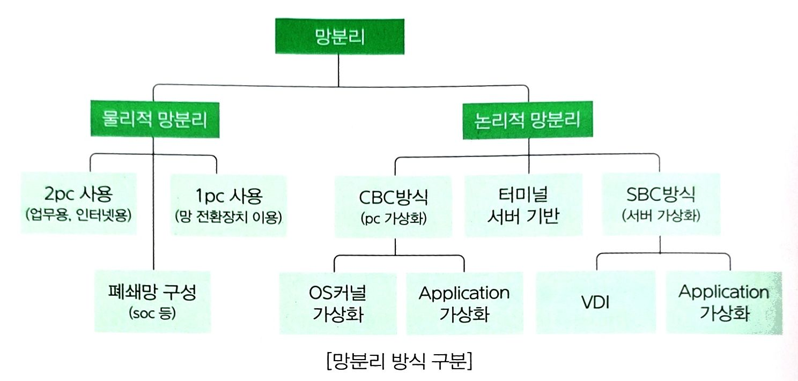
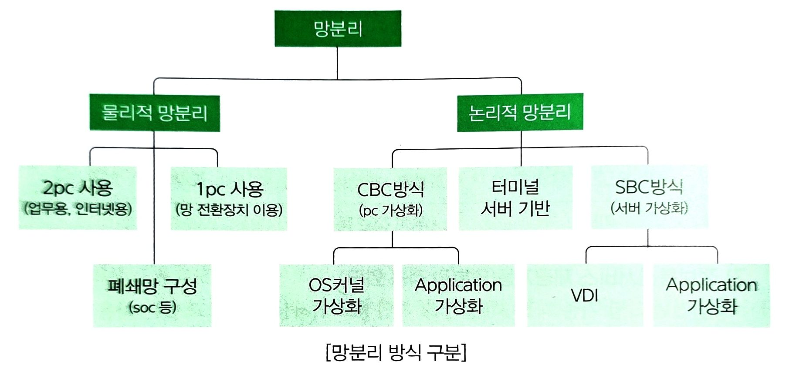
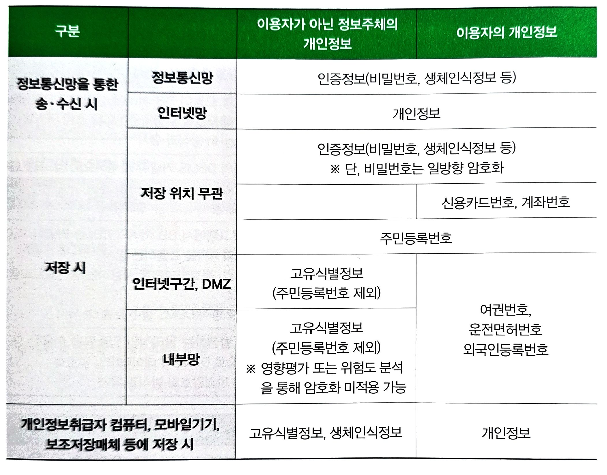
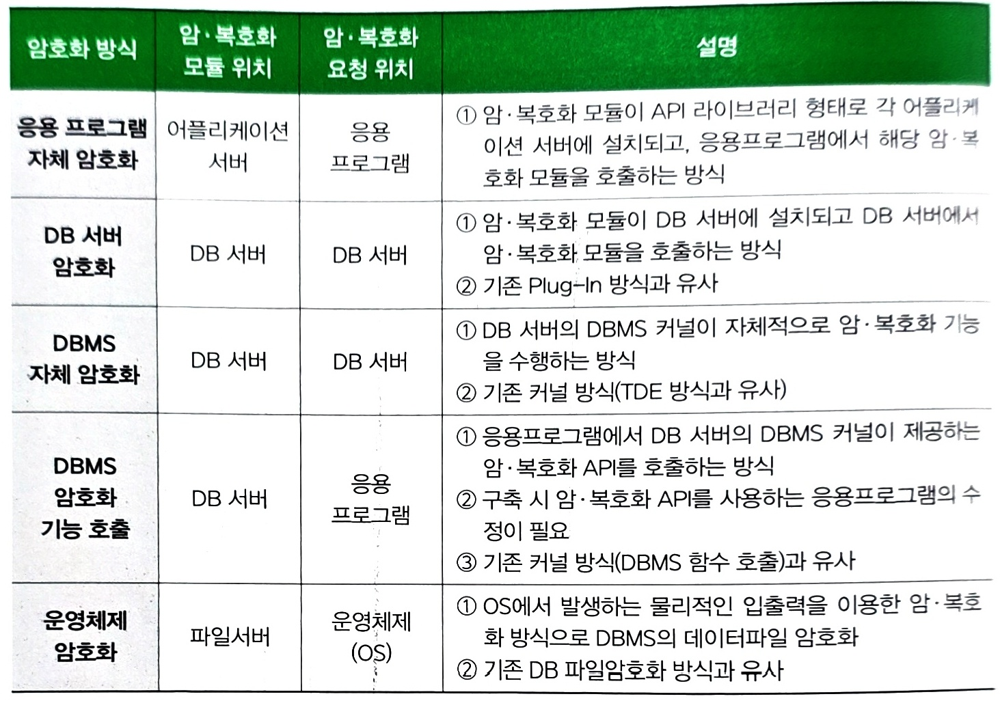
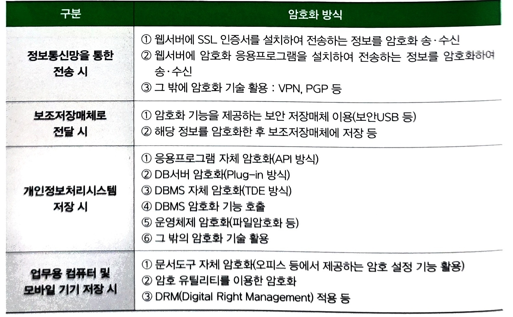
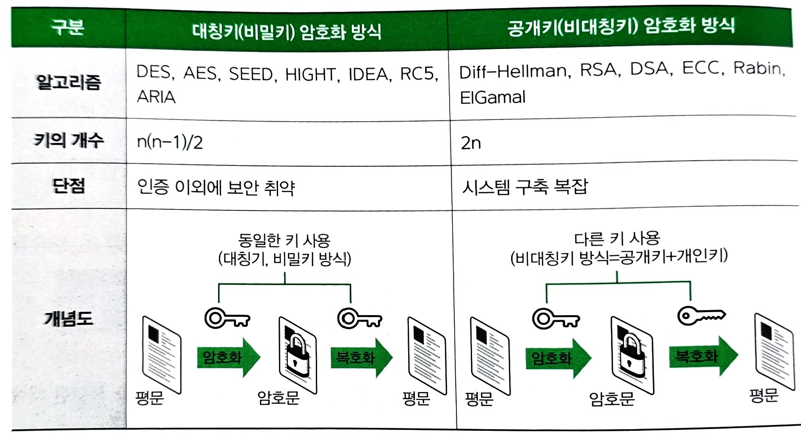
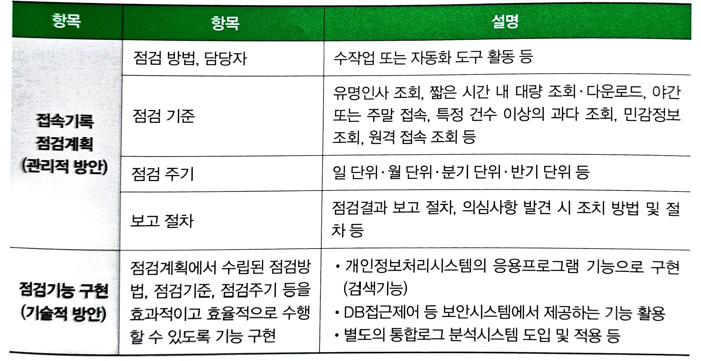

### 3. 접근 권한의 관리
#### (1) 관련 법령
```
안전성 확보조치 기준(2023.9.15) 제5조
```

#### (2) 관련 지식

1)접근 권한 차등 부여

    ① 개인정보처리자가 가명정보를 처리하는 경우, 가명정보에 접근권한이 있는 담당자가 특정 개인을 알아보기 위한 목적으로 가명정보를 처리하는 것을 방지하기 위하여 가명정보에 접근할 수 있는 담당자와 추가 정보에 접근할 수 있는 담당자를 반드시 구분하여야 한다.
    ② 가명정보에 접근권한이 있는 담당자가 특정 개인을 식별할 수 있는 정보에 접근할 수 없도록 제한하여야 한다.
    ③ 가명정보와 추가 정보에 대한 접근 권한의 분리가 어려운 정당한 사유가 있는 경우(소상공인으로서 가명정보를 취급할 자를 추가로 둘 여력이 없는 경우 등), 업무 수행에 필요한 최소한의 접근 권한 부여 및 접근 권한의 보유 현황을 기록으로 보관하는 등 접근 권한을 관리 및 통제하여야 한다.
    ④ 개인정보처리시스템의 데이터베이스에 대한 직접적인 접근은 데이터베이스 운영관리자에 한정하는 등의 안전조치를 적용할 필요성이 있다.

2)접근 권한 부여, 변경 또는 말소에 대한 내역 보관

    ① 개인정보처리자는 접근권한 부여, 변경, 말소에 대한 내역을 전자적으로 기록하거나 수기로 작성한 관리대장 등에 기록하고 해당 기록을 최소 3년간 보관하여야 한다.

3)접근권한 변경•말소 미조치 사례(예시)

    ① 다수 시스템의 접근권한 변경•말소가 필요함에도 일부 시스템의 접근권한만 변경•말소할 때
    ② 접근권한의 전부를 변경•말소하여야 함에도 일부만 변경•말소할 때
    ③ 접근권한 말소가 필요한 계정을 삭제 또는 접속차단조치를 하였으나, 해당 계정의 인증값 등을 이용하여 우회 접근이 가능할 때 등

4)비밀번호 작성규칙 적용

    ① 개인정보취급자 또는 정보주체가 안전한 비밀번호를 설정하여 이핼할 수 있도록 비밀번호 작성규칙을 수립하고 이를 개인정보처리시스템, 접근통제시스템, 인터넷 홈페이지 등에 적용하여야 한다.
    ② 비밀번호는 정당한 접속 권한을 가지지 않는 자가 추측하거나 접속을 시도하기 어렵도록 문자, 숫자 등으로 조합, 구성하여야 한다.(※비밀번호 이외의 추가적인 인증에 사용되는 휴대폰 인증, 일회용 비밀번호 등은 비밀번호 작성규칙을 적용하지 아니할 수 있음)
    ③ 개인정보처리시스템의 데이터베이스에 접속하는 DB관리자의 비밀번호는 복잡하게 구성하고 변경 주기를 짧게 하는 등 강화된 안전조치를 적용할 필요가 있다.

5)개인정보처리자 비밀번호 작성규칙(예시)
    
    ① 비밀번호는 문자, 숫자의 조합 구성에 따라 최소 8자리 또는 10자리 이상의 길이로 구성
    ② 최소 8자리 이상: 두 종류 이상의 문자를 이용하여 구성한 경우
        (※문자종류: 알파벳 대문자와 소문자, 특수문자, 숫자)
    ③ 최소 10자리 이상: 하나의 문자종류로 구성한 경우
        (※단, 숫자로만 구성할 경우 취약할 수 있음)
    ④ 비밀번호는 추측하거나 유추하기 어렵도록 설정
    ⑤ 동일한 문자 반복(aaabbb, 123123 등), 키보드 상에서 나란히 있는 문자열(qwer 등), 일련번호(12345 등), 가족이름, 생일, 전화번호 등은 사용하지 않는다.
    ⑥ 비밀번호가 제3자엑게 노출되었을 경우 지체 없이 새로운 비밀번호로 변경해야 한다.

6)계정정보 또는 비밀번호를 일정 횟수 이상 오입력 시 접근 제한
    
    ① 계정정보 또는 비밀번호를 일정 횟수 이상 잘못 입력한 경우 사용자계정 잠금 등의 조치를 취하거나 계정정보•비밀번호 입력과 동시에 추가적인 인증수단을 적용하여 정당한 접근 권한자임을 확인하는 등의 조치를 취하는 것을 말한다.

7)비밀번호 공격방법

    ① 사전공격(Dictionary Attack): 자주 사용하는 단어를 비밀번호에 대입하는 공격 방법
    ② 무작위 대입공격(Brute Force): 가능한 한 모든 값을 비밀번호에 대입해 보는 공격 방법
    ③ 레인보우 테이블공격(Rainbow Table): 무작위 대입공격시 더 빠르게 비밀번호를 시도해 보기 위해서 햇 함수를 사용하여 만들어낼 수 있는 값들을 왕창 저장한 표를 이용한 공격

8)계정/권한 관리 서비스

|구분|SSO|EAM|IAM|
|:--:|:--:|:--:|:--:|
|개념|한번의 로그인으로 다양한 시스템 혹은 인터넷 서비스를 사용할 수 있게 해주는 보안 솔루션|SSO와 사용자의 인증을 관리하며 어플리케이션 및 데이터에 대한 사용자 접근을 관리하기 위하여 보안정책 기반의 단일 매커니즘을 이용한 솔루션|단순한 한가지 어플리케이션을 지칭하는 용어가 아니라 계정관리 전반 및 프로비저닝 기능을 포함한 포괄적인 의미의 계정관리 솔루션|
|기술|PKI, LDAP|SSO, AC, LDAP, PKI 암호화|통합자원관리 + Provisioning|
|특징|단일로그인 여러 자원 접근|SSO+통합권한 관리|EAM+통합계정 관리|
|장점|사용 편의성|보안성 강화|관리 효율화|
|단점|인증 이외에 보안 취약|사용자 관리 어려움|시스템 구축 복잡|

### 4. 접근통제
#### (1) 관련 법령
```
안전성 확보조치 기준(2023.9.15) 제6조
```



물리적 망분리는 통신망, 장비 등을 물리적으로 이원화하여 인터넷 접속이 불가능한 컴퓨터와 인터넷 접속만 가능한 컴퓨터로 분리하는 방식이다. 놀리적 망분리는 물리적으로 하나의 통신망, 장비를 사용하지만 가상화 등의 방법으로 내무 업무영역과 인터넷 접속영역을 분리하는 방식이다. 컴퓨터는 물리적으로 분리하되, 네트워크는 하나의 회선을 가상화하여 분리하는 하이브리드 망분리 방식도 존재한다.

- 망분리 방식 장단점

|구분|물리적 망분리|논리적 망분리|
|:--:|:--:|:--:|
|운영방법|업무용 망과 인터넷용 망을 물리적으로 분리|가상화 등의 기술을 이용하여 논리적으로 분리|
|도입 비용|높음(추가 PC, 별도 망 구축 등)|구축환경에 따라 상이함|
|보안성|높은 보안성(근본적 분리)|상대적으로 낮은 보안성(구성 방식에 따라 취약점 발생 가능)|
|효율성|업무 환경의 효율성 저하|상대적으로 관리 용이|

#### (2) 관련 지식
1)정보통신망을 통한 불법적인 접근 및 침해사고 방지 조치
    
    ① 개인정보처리시스템에 대한 접속 권한을 IP주소, 포트, MAC(Media Access Control) 주소 등으로 제한하여 인가받지 않은 접근을 제한한다.
    ② 개인정보처리시스템에 접속한 IP 주소, 포트, MAC 주소 등을 분석하여 불법적인 개인정보 유출 시도를 탐지한다.

2)침입차단 및 침입탐지 기능을 갖춘 장비의 설치 방법 예시

    ① 침입차단시스템, 침입탐지시스템, 침입방지시스템 등 설치, 운영한다.
    ② 웹방화벽, 보안 운영체제 등 도입한다
    ③ 스위치 등의 네트워크 장비에서 제공하는 ACL 기능을 이용하여 IP 주소 등을 제한함으로써 침입차단 기능을 구현한다.
    ④ 공개용 소프트웨어를 사용하거나 운영체제에서 제공하는 기능을 활용하여 해당 기능을 포함한 시스템을 설치•운영한다.
    ⑤ 공개용 소프트웨어를 사용하는 경우에는 적절한 보안이 이루어지는지를 사전에 점검하고 정기적인 업데이트 여부 등 확인 후 적용이 필요하다.
    ⑥ 인터넷데이터센터, 클라우드 서비스, 보안업체 등에서 제공하는 보안서비스 등도 활용 가능하다.
    ⑦ 접근 제한 기능 및 유출 탐지 기능의 충족을 위해서는 단순히 시스템을 설치하는 것만으로는 부족하며, 신규 위협 대응 및 정책의 관리를 위하여 다음과 같은 방법 등을 활용하여 체계적으로 운영•관리하여야 한다.
    ⑧ 정책 설정 운영: 신규 위협 대응 등을 위하여 접근 제한 정책 및 유출 탐지 정책을 설정하고 지속적인 업데이트 적용 및 운영•관리하여야 한다.
    ⑨ 이상 행위 대응: 모니터링 등을 통해 인가받지 않은 접근을 제한하거나 인가자의 비정상적인 행동에 대응한다.
    ⑩ 로그 분석: 로그 등의 대조 또는 분석을 통하여 이상 행위를 탐지 또는 차단한다.
    ⑪ 로그는 침입차단시스템 또는 침입탐지시스템의 로그기록에 한정하지 않고 개인정보처리시스템의 접속기록, 네트워크 장비의 로그기록, 보안장비소프트웨어의 기록 등을 포함한다.
    ⑫ IP주소 등에는 IP주소, 포트 그 자체뿐만 아니라, 해당 IP주소의 행위(과도한 접속성공 및 실패, 부적절한 명령어 등 이상 행위 관련 패킷)를 포함한다.

3)이상 행위 대응(예시)

    ① 동일 IP, 해외 IP 주소에서의 과도한 또는 비정상적인 접속시도 탐지 및 차단 조치
    ② 개인정보처리시스템에서 과도한 또는 비정상적인 트래픽 발생 시 탐지 및 차단 조치 등

4)개인정보처리자(안전한 접속수단을 적용하거나 안전한 인증수단 적용)

    ① 인터넷구간 등 외부로부터 개인정보처리시스템에 대한 접속은 원칙적으로 차단하여야 하나, 개인정보처리자의 업무 특성 또는 필요에 의해 개인정보취급자가 노트북, 업무용 컴퓨터, 모바일 기기 등으로 외부에서 정보통신망을 통해 개인정보처리시스템에 접속이 필요한 경우에는 안전한 접속수단을 적용하거나 안전한 인증수단을 적용하여야 한다.
    ② 접속수단 예시: 가상사설망(VPN) 또는 전용선 등
    ③ 인증수단 예시: 인증서, 보안토큰, 일회용 비밀번호 등
    ④ 인증수단만을 적용하는 경우에는 통신 보안을 위한 암호화 기술의 추가 적용이 필요할 수 있으므로, 보안성 강화를 위하여 안전한 접속수단을 권고한다.

5)정보통신서비스 제공자(안전한 인증수단 적용)
    
    ① 인터넷 구간 등 외부로부터 개인정보처리시스템에 접속은 원칙적으로 차단하여야 하나, 정보통신서비스 제공자등의 업무 특성 또는 필요에 의해 개인정보취급자가 노트북, 업무용 컴퓨터, 모바일 기기 등으로 외부에서 정보통신망을 통해 개인정보처리 시스템에 접속이 필요할 때에는 안전한 인증수단을 적용하여야 한다.
    ② 안전한 인증 수단의 적용: 개인정보처리시스템에 사용자계정과 비밀번호를 입력하여 정당한 개인정보취급자 여부를 식별•인증하는 절차 이외에 추가적인 인증 수단을 적용한다.
    ③ 안전한 인증 수단을 적용할 때에도 보안성 강화를 위하여 VPN, 전용선 등 안전한 접속 수단의 적용을 권고한다.
    ④ IPsec, SSL 등의 기술이 사용된 가상사설망을 안전하게 사용하기 위해서는, 잘 알려진 취약점(Open SSL의 HeartBleed 취약점 등)들을 조치하고 사용할 필요가 있다.

- 사용자 인증 수단 예시

    1. 지식 기반

        - 비밀번호
            - 안전한 비밀번호 작성규칙 및 주기적 변경
            - 비밀번호 도용, 무작위 대입 공격 등에 대응
            - 시스템 설치 시 제품 등에서 제공하는 디폴트 계정 및 비밀번호 사용정지 또는 변경
    2. 소유 기반

        - 인증서
            - 개인키의 안전한 보관 필요
        - OTP
            - OTP토큰, 모바일OTP 등 다양한 방식
        - 기타
            - 스마트 카드 방식
            - 물리적 보안 토큰 방식 등
    3. 생체 기반

        - 지문, 홍채, 얼굴 등
            - 생체 정보의 안전한 관리 필요
    
    4. 기타 방식
        - IP 주소
            - 특정 IP주소에서만 해당 아이디로 접속할 수 있도록 제한
        - MAC 주소
            - 단말기의 MAC주소를 기반으로 해당 아이디로 접속할 수 있도록 제한하는 방식
        - 기기 일련번호
            - 특정 PC 또는 특정 디바이스에서만 접속할 수 있도록 제한하는 방식
        - 기타
            - 위치 정보 등

7)정보통신서비스 제공자등(망분리 적용 의무)
    
    ① 전년도 말 기준 직전 3개월간 그 개인정보가 저장•관리되고 있는 이용자 수가 일일평균 100만명 이상(제공하는 정보통신서비스가 다수일 때에는 전체를 합산하여 이용)
    ② 정보통신서비스 부문 전녀도(법인일 때에는 전 사업연도를 말한다) 매출액이 100억원 이상(정보통신서비스와 그 외 서비스를 함께 제공할 때에는 정보통신서비스 부문을 합산한 매출액만 적용)
    ③ 위에 해당하지 아니하는 정보통신서비스 제공자등은 망분리를 적용하지 아니할 수 있으나, 보안성 강화 등을 위해서 적용을 권고
    ④ 물리적 망분리: 통신망, 장비 등을 물리적으로 이원화하여 인터넷 접속이 불가능한 컴퓨터와 인터넷 접속만 가능한 컴퓨터로 분리하는 방식
    ⑤ 논리적 망분리: 물리적으로 하나의 통신망, 장비 등을 사용하지만 가상화 등의 방법으로 인터넷 접속이 불가능한 내부 업무영역만 인터넷 접속영역을 분리하는 방식

8)정보통신서비스 제공자등(망분리 적용 대상)

    ① 개인정보처리시스템에서 개인정보를 다운로드, 파기, 접근권한을 설정할 수 있는 개인정보취급자의 컴퓨터 등
    ② 개인정보처리자시스템에서 단순히 개인정보를 열람, 조회 등만을 할 때에는 망분리를 적용하지 아니할 수 있다.
    ③ 다운로드: 개인정보처리시스템에 직접 접속하여 개인정보취급자의 컴퓨터 등에 개인정보를 엑셀, 워드, 텍스트, 이미지 등의 파일형태로 저장하는 것
    ④ 파기: 개인정보처리시스템에 저장된 개인정보 파일, 레코드, 테이블 또는 데이터베이스를 삭제하는 것
    ⑤ 접근권한 설정: 개인정보처리시스템에 접근하는 개인정보취급자에게 다운로드, 파기 등의 접근권한을 설정하는 것



물리적 망분리는 통신망, 장비 등을 물리적으로 이원화하여 인터넷 접속이 불가능한 컴퓨터와 인터넷 접속만 가능한 컴퓨터로 분리하는 방식이다. 논리적 망분리는 물리적으로 하나의 통신망, 장비 등을 사용하지만 가상화 등의 방법으로 내부 업무영역과 인터넷 접속영역을 분리하는 방식이다. 컴퓨터는 물리적으로 분리하되, 네트워크는 하나의 회선을 가상화하여 분리하는 하이브리드 망분리 방식도 존재한다.

|구분|물리적 망분리|논리적 망분리|
|:--:|:--:|:--:|
|운영 방법|업무용 망과 인터넷용 말을 물리적으로 분리|가상화 등의 기술을 이용하여 논리적으로 분리|
|도입 비용|높음|구축환경에 따라 상이함|
|보안성|높은 보안성|상대적으로 낮은 보안성|
|효율성|업무 환경의 효율성 저하|상대적으로 관리 용이|

11)정보통신서비스 제공자등(개인정보취급자 비밀번호 관리)
    
    ① 영대문자, 영소문자, 숫자, 특수문자 중 2종류 이상을 조합하여 최소 10자리 이상 또는 3종류 이상을 조합하여 최소 8자리 이상의 길이로 구성하여야 한다.
    ② 연속적인 문자열이나 숯자, 생년월일, 전화번호 동 추측하기 쉬운 정보 및 아이디와 비숫한 비밀번호는 사용하지 않는 것을 권고한다.
    ③ 비밀번호에 유효기간을 설정하여 반기별 1회 이상 번경하여야 한다.
    ④ 비밀번호는 정당한 접속 권한을 가지지 않는 자가 추측하거나 접속을 시도하기 어렵도 록 문자, 숫자 등으로 조합.구성하여야 한다.

12)정보통신서비스 제공자등: 개인정보취급자 비밀번호 작성규칙

    ⑤ 비밀번호를 최소 6개월마다 변경하도록 변경기간을 적용하는 등 장기간 사용하지 않는다(※변경시 동일한 비밀번호를 교대로 사용하지 않도록 함)

13)개인정보가 인터넷 홈페이지 등 공개 유출 방지 조치

    ① 인터넷 흡메이지 중 서비스 제공에 사용되지 않거나 관리되지 않는 사이트 또는 URL(Uniform Resource Locator)에 대한 삭제 또는 차단 조치를 한다.
    ② 인터넷 홈페이지의 설계-개발 오류 또는 개인정보취급자의 업무상 부주의 등으로 인터 넷 서비스 검색엔진(구글링 등) 등을 통해 관리자 페이지와 취급중인 개인정보가 노출 되지 않도록 필요한 조치를 한다.
    ③ 인터넷 홈페이지를 통하여 개인정보가 유출될 수 있는 위험성을 줄이기 위하여 정기적 으로 웹 취약점 점검을 권고한다.
    ④ 업무상 꼭 필요한 경우라도 드라이브 전체 또는 불필요한 풀더가 공유되지 않도록 조치하고, 공유폴더에 개인정보 과일이 포함되지 않도록 정기적인 점검이 필요하다.
    ⑤ 상용 웹메일, 웹하드, 메신저, SNS 서비스 등을 통하여 고의 혹은 부주의로 인한 개인정보 유•노출 방지 조치 등이 해당될 수 있다.
    ⑥ P2P, 웹하드 등의 사용을 제한하는 경우에도 단순히 사용금지 조치를 취하는 것이 아니라 시스템 상에서 해당 포트를 차단하는 등 근본적인 안전조치를 취하는 것이 필요하다.
    ⑦ 공개된 무선망을 이용하여 개인정보를 처리 시 신뢰되지 않은 무선접속장치(AP), 무선 전송 구간 및 무선접속장치의 취약점 등에 의해 열람권한이 없는 자에게 공개되거나 유출되지 않도록 접근 통제 등에 관한 안전조치를 하여야 한다.

14)인터넷 홈페이지를 통한 개인정보 유•노출 유행

    ① 검색엔진(구글링 등) 등을 통한 개인정보 유•노출
    ② 웹 취약점을 통한 개인정보 유•노출
    ③ 인터넷 게시관을 통한 개인정보 유•노출
    ④ 홈페이지 설계•구현 오류로 인한 개인정보 유•노출
    ⑤ 기타 방법을 통한 개인정보 유•노출

19)무선망 개인정보 처리 시 보호조치

    ① 비밀번호 등 송신 시 SSL, VPN 등의 보안기술이 적용된 전용 프로그램을 사용하거나 암 호화하여 송신한다.
        ※모바일 기기, 노트북에서 개인정보처리시스템에 개인정보 전송시, 전송 암호화 기능이 탑재된 별도의 앱(App)이나 프로그램을 설치하고 이를 이용하여 전송
    ② 고유식별정보 등이 포함된 파일 송신 시 과일을 암호화하여 저장 후 송신한다.
        ※모바일 기기, 노트북에서 개인정보처리시스템에 고유식별정보가 포함된 파일 송신 시, 암호화 저장한 후 송신
    ③ 개인정보 유출 방지 조치가 적용된 공개된 무선망을 이용한다.
        ※모바일 기기, 노트북에서 설치자를 신뢰할 수 있고 관리자 비밀번호 등을 포함한 알려진 보안취약점이 조치된 무선접속장치에 안전한 비밀번호를 적용한 WVPA2(Wi-Fi Protected Access 2) 보안 프로토콜을 사용하는 공개된 무선망 사용

|구분|WEP|WPA|WPA2|
|:--:|:--:|:--:|:--:|
|인증|사전 공유된 비밀키 사용|사전에 공유된 비밀키를 사용하거나 별도의 인증서버 이용|사전에 공유된 비밀키를 사용하거나 별도의 인증서버 이용|
|암호 방법|고정 암호키 사용, RC4 알고리즘 사용|암호키 동적 변경, RC4 알고리즘 사용|암호키 동적 변경 AES 등 강력한 암호 알고리즘 사용|
|보안성|가장 취약하며 널리 사용되지 않음|WEP 방식보다 안전하나 불완전한 RC4 알고리즘 사용|가장 강력한 보안기능 제공|

20)고유식별정보를 처리 시 연 1회 취약점 점검 및 보완조치

    ① 인터넷 홈페이지를 통해 고유식별정보(주민등록번호, 운전면허번호. 외국인등록번호, 유출•변조•훼손되지 않도록 여권번호)를 처리하는 개인정보처리자는 고유식별정보가 해당 인터넷 홈페이지에 대해 연 1회 이상 취약점을 점검하여야 하며, 그 결과에 따른 개선조치를 하여야 한다.
        ※ 웹 취약점 점검 항목 예시: SQL_Injection 취약점, CrossSiteScript 취약점, File Upload 및 Download 취약접, ZeroBoard 취약점, Directory Listing 취약점, UAL 및 Parameter 변조 등
    ② 인터넷 홈페이지의 취약점 점검 시에는 기록을 남겨 책임 추적성 확보 및 향후 개선조치 등에 활용할 수 있도록 해야 한다.
    ③ 인터넷 홈페이지의 취약점 점검은 개인정보처리자의 자체인력, 보안업체 등을 활용할 수 있으며, 취약점 점검은 상용 도구, 공개용 도구, 자체 제작 도구 등을 사용할 수 있다.

- SQL 인젝션 공격
- XSS 공격
- CSRF
- 파일업로드 공격
- 쿠키값 변조 공격
- 파일 다운로드 공격
- SSL/TLS 취약점 및 종류
    - HeartBleed
    - Poodle
    - SSL Strip
    - Freak SSL
- 기타 오픈소스 취약점 및 종류
    - Log4j 취약점
    - 쉘쇼크
    - Ghost

21)일정시간 이상 업무처리를 하지 않는 경우 자동으로 시스템 접속 차단

    ① 개인정보처리시스템에 접속하는 업무용 컴퓨터 등에서 해당 개인정보처리시스템에 대한 접속의 차단을 의미하며, 업무용 컴퓨터의 화면보호기 등은 접속차단에 해당하지 않는다.
    ② 개인정보취급자가 일정시간 이상 업무치리를 하지 않아 개인정보처리시스템에 접속이 차단된 이후, 다시 접속하고자 할 때에도 최초의 로그인과 동일한 방법으로 접속하여야 한다.
    ③ 정보통신서비스 제공지등은 개인정보를 처리하는 방법 및 환경, 보안위험요인, 업무특성(DB 운영: 관리, 시스템 모니터링 및 유지보수 등) 등을 고려하이 스스로의 환경에 맞 는 최대 접속시간을 각각 정하여 시행할 수 있다.
    ④ 최대 접속시간은 최소한(통상 10~30분 이내)으로 정하여야 한다. 다만, 장시간 접속이 필요할 때에는 접속시간 등 그 기록을 보관, 관리하여야 한다.

22)접속 차단 미조치 사례
    
    ① 개인정보처리시스템에 접속 차단 등의 조치 없이 업무용 컴퓨터에 화면보호기만을 설정한 때
    ② 개인정보처리시스템 등에 다시 접속 시 자동 로그인 기능을 사용한 때
    ③ 서버접근제어 프로그램 등을 이용하여 별도의 로그인 절차 없이 개인정보처리시스템에 접속이 가능하도록 구성하면서 해당 프로그램에 접속 차단 조치를 하지 않은 때

23)업무용 컴퓨터 또는 모바일 기기를 이용하여 개인정보를 처리 시 접근 통제

    ① PC, 노트북 등의 업무용 컴퓨터의 운영체제(OS)에서 제공하는 접근 통제 기능 설정 방법은 아래와 같으며, 별도의 보안프로그램을 사용하여 접근 통제 기능을 설정하고 이용 할수있다.
    ② 모바일 기기에서는 네트워크 및 소프트웨어 통제, 인입 포트 차단 등의 접근 통제 기능을 제공하는 운영체제를 사용할 수 있으며, 접근 통제 기능을 제공하는 방화벽 등, 어플리케이션(App)을 설치•운영 할 수 있다.

24)업무용 모바일 기기의 분실•도난 등 개인정보 유출방지 대책

    ① 비밀번호, 패턴, PIN, 지문, 홍채 등을 사용하여 화면 잠금 설정
    ② 디바이스 암호화 기능을 사용하여 애플리케이션, 데이터 등 암호화
    ③ USIM 카드에 저장된 개인정보 보호를 위한 USIM 카드 잠금 설정
    ④ 모바일 기기 제조사 및 이동통신사가 제공하는 기능을 이용한 원격 잠금, 원격 데이터 삭제 
    ⑤ 중요한 개인정보를 처리하는 모바일 기기는 MDM(Mobile Device Management)등 모바일 단말 관리 프로그램을 설치하여 원격 잠금, 원격 데이터 삭제, 접속 통제 등
    ⑥ MDM은 무선망을 이용해 원격으로 스마트폰 등의 모바일 기기를 제어하는 솔루션으로서, 분실된 모바일 기기의 위치 추적, 잡금 설정, 정보 삭제, 특정 사이트 접속 제한 등의 기능제공
    ⑦  모바일 기기의 도난 또는 분실 시 원격 잠금, 데이터 삭제 등을 위해 제조사별로 지원하는 '킬 스위치(Kill Switch) 서비스'나 이동통신사의 '잠금 앱 서비스'를 이용할 수 있다.

### 5. 개인정보의 암호화
#### (1) 관련 법령
```
안전성 확보조치 기준(2023.9.15) 제7조
```

#### (2) 관련 지식
1)암호화 대상 개인정보



2)암호화 방식





3)안전한 알고리즘

|구분|취약한 알고리즘|안전한 알고리즘|
|:--:|:--:|:--:|
|대칭키 암호 알고리즘|DES, 128bit 미만의 AES, ARIA, SEED|SEED, ARIA-128/192/256, AES-128/192/256, HIGHT, LEA 등|
|공개키 암호 알고리즘|2048bit 미만의 RSA, RSAES|RSAES-OAEP, RSAES-PKCS1 등|
|일방향 암호 알고리즘|MD5, SHA-1, HAS-160|SHA-256/384/512 등|

4)알고리즘 유형 분류

- 대칭키 알고리즘
    - 블록 암호
        - DES, AES, SEED
    - 스트림 암호
        - RC4, LFSR
- 공개키 알고리즘 
    - 소인수 분해 문제
        - RSA, Rabin
    - 이산대수 문제
        - Elgamal, DSA, Diffie-Hellman
    - 타원곡선 문제
        - ECC, ECDSA, KCDSA, EC-KCDSA
- 해시 알고리즘
    - MDC
        - MD5, SHA-1, SHA-2
    - MAC
        - HMAC, CMAC, GMAC

5)개인정보 암호화하여 송신, 전달

    ① 정보통신망을 통하여 비밀번호를 송신하는 경우에는 SSL 등의 통신 암호 프로토콜이 탑재된 기술을 활용하여야 한다.
    ② 보조저장매체를 통해 고유식별정보, 비밀번호, 바이오정보를 전달하는 경우에도 암호화하여야 한다.
    ③ 암호화 기능을 제공하는 보안 USB 둥의 보조저장매체에 저장하여 전달한다.
    ④ 해당 개인정보를 암호화 저장한 후, 보조저장매체에 저장하여 전달한다.

6)개인정보 암호화 전송 기술 SSL 적용
    
    ① SSL(Secure Socket Iayer)은 웹 브라우저와 웹 서버간에 데이터를 안전하게 주고받기 위해 암호화 기술이 적용된 보안 프로토콜이다.
    ② 개인정보 암호화 전송기술 사용 시 안전한 전송을 위해 잘 알려진 취약점(예시: Open SSL 사용 시 HeartBleed 취약점)들을 조치하고 사용할 필요가 있다.

7)공개 구간 고유식별정보 암호화
    
    ① 인터넷 구간 및 인터넷 구간과 내부망의 중간 지점(DMIZ : Demilitarized Zone)에 고유 식별정보를 저장한다.
    ② 인터넷 구간은 개인정보처리시스템과 인터넷이 직접 연결되어 있는 구간을 의미한다.
    ③ DUZ 구간은 인터넷과 내부망 사이에 위치한 중간 지점 또는 인터넷 구간 사이에 위치 한 중간지점으로서 인터넷 구간에서 직접 접근이 가능한 영역이다.
    ④ 내부망은 접근통제시스템 등에 의해 차단되어 외부에서 직접 접근이 불가능한 영역이다.

8)SSL을 통한 개인정보 암호화

9)개인정보처리자가 내부망에 고유식별정보를 저장시 암호화 여부 결정

    ① 법 제33조에 파른 개인정보 영향평가의 대상이 되는 공공기관의 경우에는 해당 개인정 보 영향평가의 결과이다.
    ② 암호화 미적용시 위험도 분석에 따른 결과 단, 내부망에 주민등록번호를 저장하는 경우 조건 없이 암호화하여야 한다.

10)개인정보 암호키 관리

10만 명 이상의 정보주체에 관하여 개인정보를 처리하는 대기업•중견기업•공공기관 또는 100만명 이상의 정보주체에 관하여 개인정보를 처리하는 중소기업•단체에 해당하는 개인 정보처리자는 암호화된 개인정보를 안전하게 보관하기 위하여 안전한 암호 키 생성, 이용, 보관, 배포 및 파기 등에 관한 절차를 수립•시행하여야 한다.

|단계|설명|상태|
|:--:|:--:|:--:|
|준비 단계|암호 키가 사용되기 이전의 단계|미생성 또는 준비 단계|
|운영 단계|암호 키가 암호 알고리즘 및 연산에 사용되는 단계|운영 상태|
|정지 단계|암호 키가 더 이상 사용되지 않지만, 암호 키에 대한 접근은 가능한 단계|정지 또는 위험 상태|
|폐기 단계|암호 키가 더 이상 사용될 수 없는 단계|폐기 또는 사고 상태|

    ① 암호키는 생성됨과 동시에 준비 단계
    ② 암호키가 생성되고 한번도 사용되지 않은 경우, 폐기 가능
    ③ 준비단계의 암호키가 손상시, 해당 암호키를 정지 단계로 전환
    ④ 준비 단계의 암호키가 사용될 준비가 되면 키 관리자는 해당 암호키를 적절한 때에 운영 단계로 전환
    ⑤ 운영 단계의 암호키가 손상되면 키 관리자는 암호 키를 정지 단계로 전환
    ⑥ 암호키의 유효기간이 만료되는 등으로 더 이상 사용되지 않지만 암호키에 대한 접근이 필요한 경우, 키 관리자는 해당 암호키를 운영 단계에서 정지 단계로 전환
    ⑦ 정지 단계에 있는 암호 키가 더 이상 필요하지 않은 경우, 해당 암호키를 페기 단계로 전환하고 폐기

11)암호키 유형에 따른 암호화 방식




### 6. 접속기록의 보관 및 점검
#### (1) 관련 법령
```
안전성 확보조치 기준(2023.9.22) 제8조
```

#### (2) 관련 지식

1)접근권한 기록, 접속기록
    
    [접근권한기록, 접속기록 보관 기간]
        ① 접근권한기록 보관: 3년
        ② 접속기록 보관: 1년 or 2년(5만 명 개인정보, 고유식별정보, 민감정보 or 기간통신사업자)
        ③ 접속기록 검토주기: 월 1회
    [보관(보존)기간과 보유기간]
        ① 보관(보존)기간: 접근권한기록, 접속기록과 같이 책임추적성을 위해 보관하는 기간으로, 보관기간보다 적게 가지고 있으면 결함
        ② 보유기간: 개인정보의 목적 달성 시 파기해야 하는 기간으로 보유기간보다 오래 가지고 있으면 결함

2)개인정보처리시스템 접속기록 남길 시 유의사항
    
    ① 기록하는 정보주체 정보의 경우 민감하거나 과도한 개인정보가 저장되지 않도록 하여야 한다.
    ② 가명정보를 처리하는 경우 추가 정보의 사용 없이는 정보주체를 식별할 수 없으므로 정보주체를 구별할수 있는 정보(가명정보ID 일련번호 둥)가 있다면 '처리한 정보주체 정보' 항목으로 해당 정보를 기록하여야 하며 정보주체를 구별할 있는 정보가 없는 경우는 '처리한 정보주체 정보' 항목을 남기지 아니할 수 있다.
    ③ 검색조건문(쿼리)을 통해 대량의 개인정보를 처리했을 경우 해당 검색조건문을 정보주체 정보로 기록할 수 있으나, 이 경우 DB테이블 변경 등으로 책임추적성 확보가 어려울 수 있으므로 해당시점의 DB를 백업하는 등 책임추적성 확보를 위해 필요한 조치를 취하여야 한다.


3)개인정보처리시스템 접속기록 항목

    ① 계정: 개인정보처리시스템에서 접속자를 식별할 수 있도록 부여된 ID 등 계정 정보
    ② 접속일시: 접속한 시간 또는 업무를 수행한 시간(년-월-일, 시:분:초)
    ③ 접속지 정보: 개인정보처리시스템에 접속한 자의 컴퓨터 또는 서버의 IP 주소 등
    ④ 처리한 정보주체 정보: 개인정보취급자가 누구의 개인정보를 처리하였는지를 알 수 있는 식별정보(ID, 고객번호, 학번, 사번 등)
    ⑤ 수행업무: 개인정보취급자가 개인정보처리시스템윤 이용하여 개인정보를 처리한 내용을 알 수 있는 정보

7)개인정보처리자 접속기록 보관

    ① 상시적으로 접속기록 백업을 수행하여 개인정보처리시스템 이외의 별도의 보조저장매체나 별도의 저장장치에 보관
    ② 접속기록에 대한 위•변조를 방지하기 위해서는 CD-ROM, DVD-R, WORM(Write Once Read Many) 등과 같은 덮어쓰기 방지 매체를 사용
    ③ 접속기록을 수정 가능한 매체(하드디스크, 자기 테이프 등)에 백업하는 경우에는 무결성 보장을 위해 위•변조 여부를 확인할 수 있는 정보를 별도의 장비에 보관•관리
        ※접속기록을 HDD에 보관하고, 위•변조 여부를 확인할 수 있는 정보(MAC 값, 전자서명 값 등)는 별도의 HDD 또는 관리대장에 보관하는 방법 등으로 관리할 수 있음

8)정보통신서비스 제공자등 접속기록 보관
    
    ① 정기적으로 접속기록 백업을 수행하여 개인정보처리시스템 이외의 별도의 물리적인저 장장치에 보관
    ② 접속기록을 수정 가능한 매체(하드디스크, 자기 테이프 등)에 백업할 때에는 위변조 여부를 확인할 수 있는 정보를 별도의 장비에 보관, 관리
    ③ 다양한 접속기록 위변조 방지 기술의 적용 등

9)개인정보처리시스템 접속기록 점검 방안 예시



### 7. 악성프로그램 등 방지
#### (1) 관련 법령
```
안전성 확보조치 기준(2023.9.15) 제9조
```
