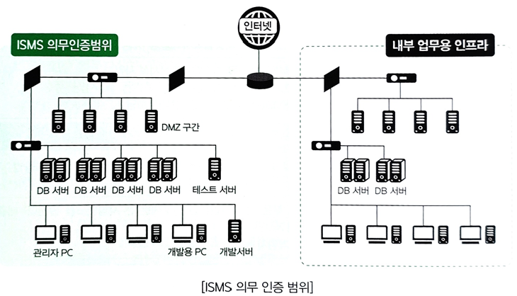
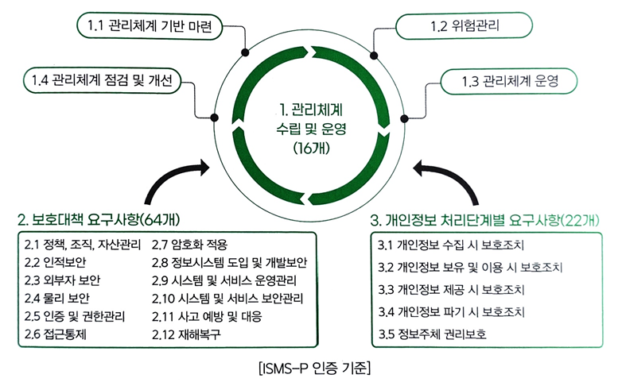
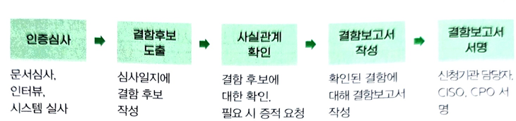

#### (4) ISMS-P 인증 범위

1)ISMS-P 인증 범위 요약

- ISMS-P 인증
    - ISMS 인증(인증기준 1,2)
        - 정보통신서비스 등의 운영을 위한 조직 및 인력
            - 시스템 운영팀, 정보보안팀, 인사팀 등
            - 관제, 재해복구
        - 정보통신서비스 등의 운영을 위한 물리적 장소
            - 시스템 운영장소
            - 정보서비스 운영 관련 부서
        - 정보통신서비스 등의 운영을 위한 설비
            - 정보시스템, 네트워크시스템, 보안시스템, 보호설비(UPS, 항온항습기, 화재감지, 누수감지 등)
    - 개인정보보호(인증기준 3)
        - 개인정보 처리를 위한 조직 및 인력
            - 고객센터, 영업점, 물류센터
            - 개인정보보호팀 등
        - 개인정보 처리를 위한 물리적 장소
            - 개인정보 처리 부서
            - 개인정보 처리 수탁사

2)ISMS 인증범위 설정(예시)



3)ISMS 인증 의무대상자 인증범위 기준

인증의무대상자인 경우, 인증범위는 신청기관의 정보통신서비스를 모두 포함하여 설정해야 한다.
① 정보통신서비스란 전기통신사업자의 전기통신역무를 이용하여 정보를 제공하거나 정보의 제공을 매개하는 서비스를 말한다.
② 인증범위는 신청기관이 제공하는 정보통신서비스를 기준으로, 해당 서비스에 포함되거나 관련 있는 자산, 조직 등을 모두 포함한다.
③ 해당 서비스의 직접적인 운영 및 관리를 위한 백오피스 시스템은 인증범위에 포함되며, 해당 서비스와 관련이 없더라도 그 서비스의 핵심정보자산에 접근 가능하다면 포함한다.
④ ISMS 의무인증범위 내에 있는 서비스, 자산, 조직을 보호하기 위한 보안시스템은 모두 포함한다.
⑤ 정보통신서비스와 직접적인 관련성이 낮은 전자적자원관리시스템, 분석용데이터베이스, 그룹웨어 등 기업 내부 시스템, 영업•마케팅 조직은 일반적으로 인증범위에서 제외한다.

4)서비스 유형별 인증범위
인증범위를 설정하기 위해서는 신청기관이 제공하는 정보통신서비스를 분류하고, 해당 서비스를 위한 자산 및 조직을 모두 식별해야 한다. 정보통신서비스 부문 매출액 또는 일일평균 이용자 수 요건에 해당하여 의무대상으로 포함된 경우는 정보통신서비스가 외부 정보통신망을 통해 접근 가능한지의 여부에 따른 의무 심사범위를 구분할 수 있다.
|구분|서비스|설비|
|:--:|:--:|:--:|
|정보통신망 서비스제공자|전국망을 통한 정보통신망 서비스|IP기반의 인터넷 연결을 위한 정보통신설비 및 관리 서비스를 제공하기 위한 정보통신설비|
|직접정보통신시설|정보통신서비스를 제공하는 고객의 위탁을받아 컴퓨터에 장치 및 정보시스템을 구성하는 일정한 공간에 집중하여 시설을 운영•관리하는 서비스(공간 임대서비스, 서버 호스팅, 네트워크 서비스 등)|집적정보통신시설의 관리운영 용도로 설치된 컴퓨터 장치 및 네트워크 장비 등의 정보통신설비|
|연간 매출액, 이용자 수 등이 정보통신망법 및 시행령 기준에 해당하는 자|불특정 다수의 이용자가 접근 가능한 모든 정보통신서비스|해당 정보통신서비스의 제공 또는 운영을 위해 필요한 정보통신설비|

5)외부 정보통신망 공개 여부에 따른 의무 심사범위

- 인터넷 공개여부
    - 공개,의무범위 O
        - 외부 정보통신망을 통해 불특정 다수 또는 권한을 가지고 있는 자가 직접적으로 접근이 가능한 서비스
        - 인증 의무대상인 신청기관이 다수의 정보통신서비스를 운영하는 경우, 개별 정보통신서비스가 인증 의무대상에 포함되지 않아도 모두 인증범위에 포함
        - IP주소 제한을 통해 특정 위치 및 단말에서만 접속이 가능하도록 접근 제어가 되어 있다 하더라도, 외부 정보통신망을 통해 직접 연결이 되어 있다면 인증범위에 포함
        - 웹기반 서비스 뿐만 아니라 모바일 기반 서비스도 동일한 기준이 적용됨
    - 미공개,의무범위 X
        - 외부 정보통신망을 통해 직접 접속이 불가능한 내부용 서비스

6)심사 의무대상자 정보통신서비스
영리를 목적으로 하지 않더라도 정보통신망을 통해 정보를 제공하거나 정보의 제공을 매개하는 서비스는 모두 인증범위에 포함한다.
|유형|설명|예시|
|:--:|:--:|:--:|
|대표홈페이지|기업의 대표홈페이지|단순 홈페이지 포함|
|채용사이트|인터넷을 통하여 채용공고, 입사지원 등 채용 절차를 수행하는 시스템|온라인 채용시스템|
|비영리 사이트|비영리 목적으로 운영하는 인터넷 사이트|공익 사이트, 학교 홈페이지|
|기타|임지원 복지를 위한 인터넷 시스템|인터넷 방문예약|
|    |기타 대외 서비스 및 업무처리를 위해 인터넷에 공개된 시스템|인터넷 신문고 등|

7)시스템 유형별 인증범위 고려사항
- 응용프로그램
    - 포함
        - 정보통신망을 통해 이용자에게 직접 노출되거나 접점이 되는 응용시스템은 심사범위에 포함
        - 정보통신서비스의 제공 또는 운영을 위하여 직접적으로 관련된 서비스 제공시스템, 서비스 관리용 시스템, 백오피스 시스템 등은 심사범위에 포함
    - 제외
        - 정보통신서비스의 데이터베이스를 직접 이용하지 않고, 복제 등의 방법으로 별도 데이터베이스를 구성한 후 이를 분석, 마케팅 등의 용도로 사용하는 응용 시스템은 심사범위에서 제외
- 데이터베이스
    - 포함
        - 인증 대상 서비스 및 응용시스템을 위해 필요한 데이터가 저장•관리되는 데이터베이스는 심사범위에 포함
- 서버
    - 포함
        - 인증범위에 포함된 서비스 및 응용시스템이 설치되어 운영되는 서버는 심사범위에 포함
        - 인증범위에 포함된 서비스 및 응용프로그램의 개발 및 운영•보안 관리를 위해 필요한 서버는 심사범위에 포함
        - 임대장비 등 소유자가 해당 기업이 아니더라도, 데이터 등 실질적인 운영 또는 서비스에 이용하고 있는 경우에는 심사범위에 포함
- 네트워크
    - 포함
        - 인증 대상 서비스와 직접적으로 관련된 네트워크 장비는 모두 포함
        - 인증범위에 포함된 정보자산의 연결 및 구성을 위한 네트워크 장비는 포함
        - 인증범위에 포함된 조직 및 인력이 인터넷 사용, 원격접속 등을 위해 필요한 네트워크 장비는 포함
    - 제외
        - 별도의 보안설정 없는 더미 역할을 하는 스위치는 심사범위에서 제외 가능
- 정보보호시스템
    - 포함
        - 내•외부 침해로부터 인증 대상 서비스 및 관련 자산을 보호하기 위한 정보보호시스템은 심사범위에 포함
        - 인증범위에 포함된 조직 및 인력을 대상으로 적용된 정보보호시스템은 심사범위에 포함
- 클라우드서비스 이용 시
    - 포함
        - 신청기관이 클라우드서비스를 이용하여 정보통신서비스를 제공하는 경우, 신청기관이 관리 가능한 운영체제, DB, 응용프로그램 등은 인증범위에 포함
        - 국내 및 해외 클라우드 서비스 모두 해당 범위에 포함됨
    - 제외
        - 클라우드서비스 형태에 따라 심사범위가 달라질 수 있으므로 관리 범위, 지배권 소유 여부, 책임 소재 등에 따라 심사범위를 판단해야 함

8)ISMS 인증심사 생략

① 관련법령

```
정보보호 및 개인정보보호 관리체계 인증 등에 관한 고시
제20조(인증심사의 일부 생략 신청 등)
```

② ISMS 인증심사 일부 생량의 범위
- 2.1 정책, 조직, 자산 관리
    - 2.1.1 정책의 유지관리
    - 2.1.2 조직의 유지관리
    - 2.1.3 정보자산 관리
- 2.2 인적 보안
    - 2.2.1 주요 직무자 지정 및 관리
    - 2.2.2 직무 분리
    - 2.2.3 보안 서약
    - 2.2.4 인식제고 및 교육훈련
    - 2.2.5 퇴직 및 직무변경 관리
    - 2.2.6 보안 위반 시 조치
- 2.3 외부자 보안
    - 2.3.1 외부자 현황 관리
    - 2.3.2 외부자 계약 시 보안
    - 2.3.3 외부자 보안 이행 관리
    - 2.3.4 외부자 계약 변경 및 만료 시 보안
- 2.4 물리 보안
    - 2.4.1 보호구역 지정
    - 2.4.2 출입통제
    - 2.4.3 정보시스템 보호
    - 2.4.4 보호설비 운영
    - 2.4.5 보호구역 내 작업
    - 2.4.6 반출입 기기 통제
    - 2.4.7 업무환경 보안
- 2.12 재해복구
    - 2.12.1 재해, 재난 대비 안전조치
    - 2.12.2 재해 복구 시험 및 개선

#### (5) ISMS-P 인증심사원
ISMS-P 인증심사원이란 한국인터넷진흥원으로부터 인증심사를 수행할 수 있는 자격을 부여 받고 인증심사를 수행하는 자를 말한다.(정보보호 및 개인정보보호 관리체계 인증 등에 관한 고시)

1)인증심사원 등급별 자격 요건
|구분|경력 인정 요건|연수|
|:--:|:--:|:--:|
|정보보호 경력|"정보보호"관련 박사 학위 취득자|2년|
|            |정보보호 관련 석사 학위 취득자, 정보보안기사, 정보시스템감사통제협회의 정보시스템감사사, 국제정보시스템보안자격협회의 정보시스템 보호전문가|1년|
|개인정보보호 경력|"개인정보보보호"관련 박사 학위 취득자|2년|
|                |"개인정보보호"관련 석사 학위 취득자, 개인정보 영향쳥가에 관한 고시 제6조에 따른 개인정보 영향평가 전문인력, 개인정보관리사|1년|
|정보기술 경력|"정보기술"관련 박사 학위 취득자, 정보관리기술사, 컴퓨터시스템응용기술사, 정보시스템감리사|2년|
|            |"정보기술"관련 석사 학위 취득자, 정보시스템감리원, 정보처리기사, 전자계산기초응용기사|1년|

2)인증심사원 등급별 자격 요건
|구분|내용|
|:--:|:--:|
|4년제 대학|4년제 대학졸업 이상 또는 이하 동등학력을 취득|
|6년 이상|정보보호, 개인정보보호 또는 정보기술 경력을 합하여 6년 이상을 보유|
|필수 1년|정보보호 및 개인정보보호 경력을 각 1년 이상 필수록 보유|

3)인증심사원 자격요건 핵심사항
|구분|내용|
|:--:|:--:|
|합산불가|두 가지 이상 중복 업무경력인 경우에 경력기간을 중복하여 합산하지 않음|
|10년 이내|모든 해당 경력은 신청일 기준 최근 10년 이내의 경력에 한해 인정|
|보안 필수|정보보호 또는 개인정보보호 필수 경력을 인정경력으로 대체할 수 있으며 중복 인정 불가|
|완료 자격증|신청일 기준 취득 완료한 자격만 인증|

4)인증심사원 등급
|구분|자격기준|1일 자문료|
|:--:|:--:|:--:|
|심사원보|인증심사원 자격 신청 요건을 만족하는 자로서 인터넷진흥원이 수행하는 인증심사원 양성과정 통과하여 자격을 취득한 자|200,000원|
|심사원|심사원보 자격 취득자로서 인증심사에 4회 이상 참여하고 심사일수의 합이 20일 이상인 자|300,000원|
|선임심사원|심사원 자격 취득자로서 정보보호 및 개인정보보호 관리체계 인증심사를 3회 이상 참여하고 심사일수의 합이 15일 이상인 자|350,000원|
|책임심사원|인터넷진흥원은 인증심사원의 인증심사 능력에 따라 매년 책임심사원을 지정할 수 있다|450,000원|

5)책임심사원 등급 부여
심사능력이 우수하고 참여율이 높은 심사원에 대해 책임심사원 등급부여(기간 1년)
- 책임심사원
    - 선임심사원이 매년 1월 1일 기준으로 1년 동안 다음의 요건을 모두 만족하는 경우 다음해 1년 동안 책임심사원으로 활동
        
        ① ISMS-P 2회 포함하여 인증심사 4회 이상 참여하고 심사일수의 합이 20일 이상
        ② 최초 또는 갱신심사 1회 이상 참여
        ③ 인증심사 수행 결과에 대한 심사원 평가 충족

6)심사원 평가 기준(KISA 지침)
|평가항목|평가방법|
|:--:|:--:|
|인증기준 이해력|분야 전문성, 자료요구 및 인터뷰 내용과 인증기준과 연관성 등|
|심사 보고서 작성능력|양식작성, 문맥오류, 보고서의 논리력 및 전달력, 기한 내 작성 등|
|피심사자와의 의사소통 능력|인터뷰 언행, 자료요구 및 현장심사 태도 등|
|결함 판단 능력|정보수집력, 결함에 따른 조치방안의 적절성 등|
|협업 및 심사태도|심사팀 내 의견제시, 심사참여 적극성, 심사준비, 시간준수, 복장, 보안의식 등|
|인증심사 관련 이의제기|타당성이 인정된 민원 접수 건|

#### (6) ISMS-P 인증기준


1)ISMS, ISMS-P 인증영역
|영역|분야|ISMS|ISMS-P|
|:--:|:--:|:--:|:--:|
|1. 관리체계 수립 및 운영|1.1 관리체계 기반 마련|O|O|
|                       |1.2 위험 관리|O|O|
|                       |1.3 관리체계 운영|O|O|
|                       |1.4 관리체계 점검 및 계산|O|O|
|2. 보호대책 요구사항|2.1 정책, 조직, 자산 관리|O|O|
|                   |2.2 인적보안|O|O|
|                   |2.3 외부자 보안|O|O|
|                   |2.4 물리 보안|O|O|
|                   |2.5 인증 및 권한관리|O|O|
|                   |2.6 접근통제|O|O|
|                   |2.7 암호화 적용|O|O|
|                   |2.8 정보시스템 도입 및 개발 보안|O|O|
|                   |2.9 시스템 및 서비스 운영관리|O|O|
|                   |2.10 시스템 및 서비스 보안관리|O|O|
|                   |2.11 사고 예방 및 대응|O|O|
|                   |2.12 재해복구|O|O|
|3. 개인정보 처리 단계별 요구사항|3.1 개인정보 수집 시 보호조치|-|O|
|                              |3.2 개인정보 보유 및 이용 시 보호조치|-|O|
|                              |3.3 개인정보 제공 시 보호조치|-|O|
|                              |3.4 개인정보 파기 시 보호조치|-|O|
|                              |3.5 정보주체 권리보호|-|O|



- 결함보고서 구성항목
    - 인증심사 기본 정보
        - 인증 유형, 일자, 회사, 담당자
    - 결함 유형
        - 중결함: 중대한 결함
        - 결함: 일반적인 결함
        - 권고: 경미한 결함
    - 인증 기준
        - 관리체계
        - 보호대책
        - 개인정보
    - 관련 근거
        - (인증기준)그대로 받아 씀
        - (법령)필요 시 작성
        - (내부규정)필요 시 작성
    - 운영현황 및 결함내역
        - (운영현황)현재 운영현황을 요약하여 작성
        - (결함내역)구체적인 정황을 팩트 기반으로 작성
        - 대상시스템, 대상자, IP주소 등
        - (조치사항)보안요구사항을 명시하고, 구체적인 방안은 지향함
    - 근거목록
        - 심사 시 근거가 되는 문서 또는 증적 자료
    - 문서 품질
        - 보고서용 문어체와 자구 사용
        - 폰트, 정렬, 표 등 문서 품질 확보

3)ISMS-P 인증기준

- 1.관리체계 수립 및 운영
    - 1.1 관리체계 기반 마련
        - 1.1.1 경영진의 참여
        - 1.1.2 최고책임자의 지침
        - 1.1.3 조직 구성
        - 1.1.4 범위 설정
        - 1.1.5 정책 수립
        - 1.1.6 자원 할당
    - 1.2 위험 관리
        - 1.2.1 정보자산 식별
        - 1.2.2 현황 및 흐름분석
        - 1.2.3 위험 평가
        - 1.2.4 보호대책 선정
    - 1.3 관리체계 운영
        - 1.3.1 보호대책 구현
        - 1.3.2 보호대책 공유
        - 1.3.3 운영현황 관리
    - 1.4 관리체계 점검 및 개선
        - 1.4.1 법적 요구사항 준수
        - 1.4.2 관리체계 점검
        - 1.4.3 관리체계 개선
- 2. 보호대책 요구사항
    - 2.1 정책, 조직, 자산 관리
        - 2.1.1 정책의 유지관리
        - 2.1.2 조직의 유지관리
        - 2.1.3 정보자산 관리
    - 2.2 인적 보안
        - 2.2.1 주요 직무자 지정 및 관리
        - 2.2.2 직무 분리
        - 2.2.3 보안 서약
        - 2.2.4 인식제고 및 교육훈련
        - 2.2.5 퇴직 및 직무변경 관리
        - 2.2.6 보안 위반 시 조치
    - 2.3 외부자 보안
        - 2.3.1 외부자 현황 관리
        - 2.3.2 외부자 계약 시 보안
        - 2.3.3 외부자 보안 이행 관리
        - 2.3.4 외부자 계약 변경 및 만료 시 보안
    - 2.4 물리 보안
        - 2.4.1 보호구역 지정
        - 2.4.2 출입통제
        - 2.4.3 정보시스템 보호
        - 2.4.4 보호설비 운영
        - 2.4.5 보호구역 내 작업
        - 2.4.6 반출입 기기 통제
        - 2.4.7 업무환경 보안
    - 2.5 인증 및 권한관리
        - 2.5.1 사용자 계정 관리
        - 2.5.2 사용자 식별
        - 2.5.3 사용자 인증
        - 2.5.4 비밀번호 관리
        - 2.5.5 특수 계정 및 권한관리
        - 2.5.6 접근권한 검토
    - 2.6 접근 통제
        - 2.6.1 네트워크 접근
        - 2.6.2 정보시스템 접근
        - 2.6.3 응용프로그램 접근
        - 2.6.4 데이터베이스 접근
        - 2.6.5 무선 네트워크 접근
        - 2.6.6 원격접근 통제
        - 2.6.7 인터넷 접속 통제
    - 2.7 암호화 적용
        - 2.7.1 암호정책 적용
        - 2.7.2 암호키 관리
    - 2.8 정보시스템 도입 및 개발 보안
        - 2.8.1 보안 요구사항 정의
        - 2.8.2 보안 요구사항 검토 및 시험
        - 2.8.3 시험과 운영 환경 분리
        - 2.8.4 시험 데이터 보안
        - 2.8.5 소스 프로그램 관리
        - 2.8.6 운영환경 이관
    - 2.9 시스템 및 서비스 운영 관리
        - 2.9.1 변경관리
        - 2.9.2 성능 및 장애관리
        - 2.9.3 백업 및 복구관리
        - 2.9.4 로그 및 접속기록 관리
        - 2.9.5 로그 및 접속기록 점검
        - 2.9.6 시간 동기화
        - 2.9.7 정보자산의 재사용 및 폐기
    - 2.10 시스템 및 서비스 보안 관리
        - 2.10.1 보안시스템 운영
        - 2.10.2 클라우드 보안
        - 2.10.3 공개서버 보안
        - 2.10.4 정보전송 보안
        - 2.10.5 정보전송 보안
        - 2.10.6 업무용 단말기기 보안
        - 2.10.7 보조저장매체 관리
        - 2.10.8 패치관리
        - 2.10.9 악성코드 통제
    - 2.11 사고 예방 및 대응
        - 2.11.1 사고 예방 및 대응체계 구축
        - 2.11.2 취약점 점검 및 조치
        - 2.11.3 이상행위 분석 및 모니터링
        - 2.11.4 사고 대응 훈련 및 개선
        - 2.11.5 사고 대응 및 복구
    - 2.12 재해복구
        - 2.12.1 재해•재난 대비 안전조치
        - 2.12.2 재해 복구 시험 및 개선
- 3. 개인정보 처리 단계별 요구사항
    - 3.1 개인정보 수집 시 보호조치
        - 3.1.1 개인정보 수집•이용
        - 3.1.2 개인정보의 수집 제한
        - 3.1.3 주민등록번호 처리 제한
        - 3.1.4 민감정보 및 고유식별정보의 처리 제한
        - 3.1.5 간접수집 보호조치
        - 3.1.6 영상정보처리기기 설치•운영
        - 3.1.7 홍보 및 마케팅 목적 활용 시 조치
    - 3.2 개인정보 보유 및 이용 시 보호조치
        - 3.2.1 개인정보 현황관리
        - 3.2.2 개인정보 품질보장
        - 3.2.3 이용자 단말기 접근 보호
        - 3.2.4 개인정보 목적 외 이용 및 제공
        - 3.2.5 가명정보 처리
    - 3.3 개인정보 제공 시 보호조치
        - 3.3.1 개인정보 제3자 제공
        - 3.3.2 업무 위탁에 따른 정보주체 고지
        - 3.3.3 영업의 양수 등에 따른 개인정보의 이전
        - 3.3.4 개인정보의 국외이전
    - 3.4 개인정보 파기 시 보호조치
        - 3.4.1 개인정보의 파기
        - 3.4.2 처리목적 달성 후 보유 시 조치
        - 3.4.3 휴면 이용자 관리
    - 3.5 정보주체 권리보호
        - 3.5.1 개인정보처리방침 공개
        - 3.5.2 정보주체 권리보장
        - 3.5.3 이용내역 통지

4)ISMS 인증심사 생략
```
정보보호 및 개인정보보호 관리체계 인증 등에 관한 고시
제20조(인증심사의 일부 생략 신청 등)
```

- 2.1 정책, 조직, 자산 관리
    - 2.1.1 정책의 유지관리
    - 2.1.2 조직의 유지관리
    - 2.1.3 정보자산 관리
- 2.2 인적보안
    - 2.2.1 주요 직무자 지정 및 관리
    - 2.2.2 직무 분리
    - 2.2.3 보안 서약
    - 2.2.4 인식제고 및 교육훈련
    - 2.2.5 퇴직 및 직무변경 관리
    - 2.2.6 보안 위반 시 조치
- 2.3 외부자 보안
    - 2.3.1 외부자 현황 관리
    - 2.3.2 외부자 계약 시 보안
    - 2.3.3 외부자 보안 이행 관리
    - 2.3.4 외부자 계약 변경 및 만료 시 보안
- 2.4 물리 보안
    - 2.4.1 보호구역 지정
    - 2.4.2 출입통제
    - 2.4.3 정보시스템 보호
    - 2.4.4 보호설비 운영
    - 2.4.5 보호구역 내 작업
    - 2.4.6 반출입 기기 통제
    - 2.4.7 업무환경 보안
- 2.12 재해복구
    - 2.12.1 재해, 재난 대비 안전조치
    - 2.12.2 재해 복구 시험 및 개선

